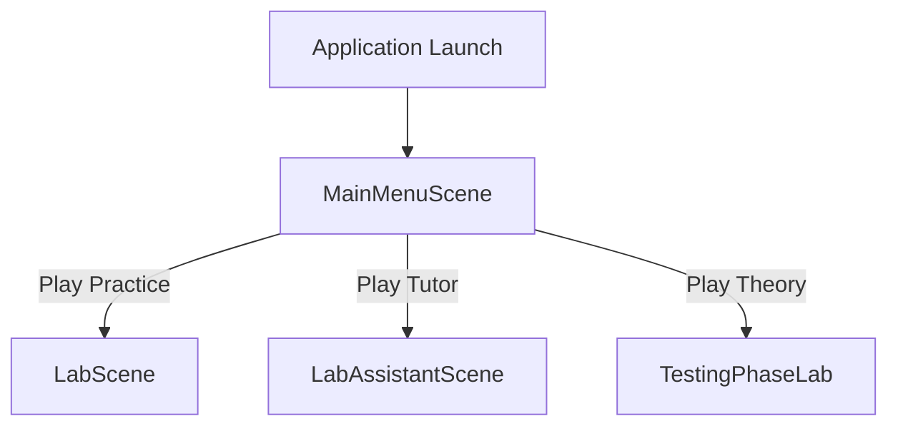
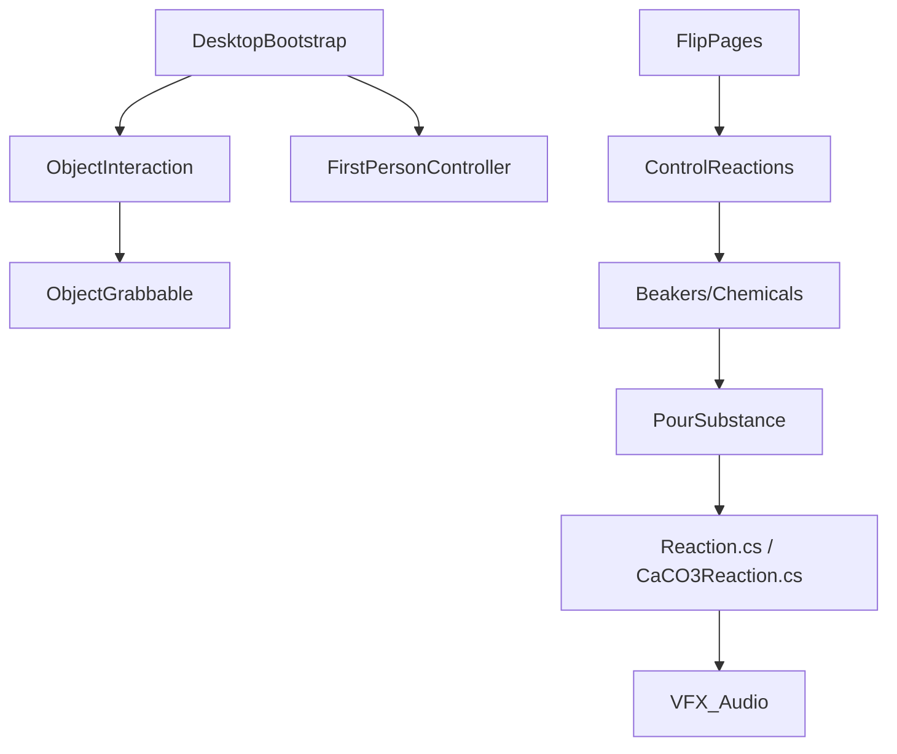
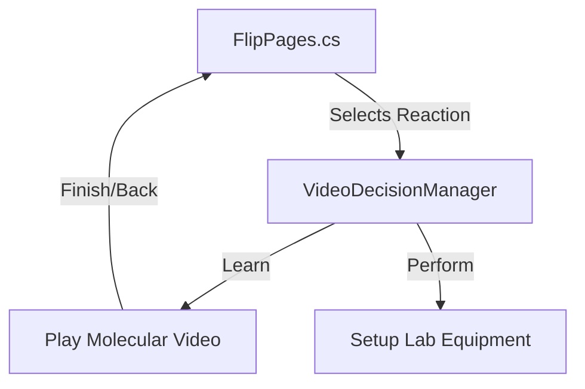

# ATOMIX PROJECT AUDIT

## 1. Executive Summary

Atomix is an educational chemistry simulator built in Unity, designed to support both Virtual Reality (VR) and desktop environments. The project focuses on interactive learning through a digital laboratory where players can select chemical reactions via an in-game "Book" and physically perform them by manipulating beakers, pipettes, and burners.

**Current State:**
* **Scenes:** The project consists of four main scenes: `MainMenuScene`, `LabScene`, `LabAssistantScene`, and `TestingPhaseLab`. 
* **Reactions:** There are exactly 8 hardcoded reactions implemented, controlled centrally by `ControlReactions.cs` and dedicated reaction scripts (e.g., `Reaction.cs`, `CaCO3Reaction.cs`).
* **Architecture:** Atomix utilizes a highly coupled, script-driven architecture where reaction state logic relies directly on polling physical interaction events (e.g., checking if tilt angles meet pouring thresholds). 
* **VR & Desktop:** VR input uses XR Interaction Toolkit components (inferred from `DesktopBootstrap.cs` exclusions). Desktop functionality is dynamically added at runtime via `DesktopBootstrap.cs`, which retrofits VR components with simulated `ObjectInteraction` and `FirstPersonController` logic.
* **AI Tutor:** Inworld AI is integrated (`LabAssistantScene`) using `InworldController` to manage push-to-talk and subtitle UI, enabling conversational learning.

**Readiness for Molecular Video Feature:**
The architecture allows for the future "Learn / Perform" molecular video feature to be cleanly integrated at the book interface level (`FlipPages.cs`). Instead of firing the reaction immediately, the book can open a secondary UI.

**Recommended Next Step:**
Introduce a lightweight data abstraction (e.g., a `ScriptableObject` for Reaction Data) to decouple `ControlReactions.cs` from hardcoded GameObjects before injecting the new video player UI.

---

## 2. Audit Scope & Method

* **Scope:** Complete analysis of the Atomix Unity project directory, prioritizing `Assets`, `Packages`, and `ProjectSettings`.
* **Method:** Read-only static analysis and deep code tracing. No files, scenes, or configurations were modified. Project files were located in the `VR` directory.
* **Objective:** Map project architecture, identify code health/technical debt, and assess readiness for a future "Learn/Perform" molecular video feature without implementing it.

---

## 3. Project Overview

**Path:** `c:/Users/karti/Desktop/All Desktop Apps/Atomix/VR`
Atomix focuses heavily on physics-based chemistry interactions. Players navigate a lab, select an experiment from a book, and perform it. Success triggers visual (ParticleSystems) and auditory feedback, alongside voice-over instructions.

---

## 4. Technology Stack

* **Engine:** Unity `6000.3.7f1`
* **Render Pipeline:** Built-in / URP (Universal Render Pipeline indicated in some roots, but manifest suggests standard modules).
* **XR Framework:** OpenXR / XR Interaction Toolkit (evident from `DesktopBootstrap.cs` disabling locomotion, tracked pose, and teleportation components).
* **Input System:** Unity New Input System (`InputSystem_Actions.inputactions` found in project roots).
* **AI:** Inworld AI (`com.inworld.unity.core` package).
* **UI:** Unity UI (Canvas/UGUI) and TextMeshPro.

---

## 5. Directory Architecture

```text
Atomix/
├── My project (1)/                 (LIKELY: Old/backup project or empty shell)
└── VR/                             (CONFIRMED: Main working directory)
    ├── Assets/
    │   ├── AnimatorControllers/    (Animation states for hands and containers)
    │   ├── Inworld/                (Inworld AI SDK and prefabs)
    │   ├── Oculus Hands/           (VR hand models)
    │   ├── Prefabs/                (Lab equipment, chemicals)
    │   ├── Scenes/                 (LabScene, MainMenuScene, etc.)
    │   ├── Scripts/                (Core logic - chemistry, desktop, UI)
    │   ├── Sounds/                 (Reaction feedback and voiceovers)
    │   ├── TextMesh Pro/           (Fonts)
    │   └── XR/                     (XR configuration and settings)
    ├── Packages/                   (Unity package manifest)
    └── ProjectSettings/            (Unity configuration)
```

---

## 6. Package/Dependency Analysis

Based on `Packages/manifest.json` and project files:
* **`com.inworld.unity.core`**: Local package reference. Drives the AI Tutor.
* **`com.unity.ai.assistant` & `com.unity.ai.inference`**: Unity AI tools.
* **`com.unity.modules.vr` & `com.unity.modules.xr`**: Core XR support.
* **XR Interaction Toolkit**: Though not explicitly in `manifest.json`, classes like `ContinuousMove`, `Teleport`, and `Locomotion` are heavily referenced.

---

## 7. Scene Architecture

1. **`MainMenuScene.unity`**
   * **Purpose:** Initial entry point.
   * **Core Logic:** `MainMenu.cs` controls transitions.
2. **`LabScene.unity`**
   * **Purpose:** The primary chemistry laboratory. Contains the book, lab equipment, and all 8 reactions.
3. **`LabAssistantScene.unity`**
   * **Purpose:** Variant of the lab containing the Inworld AI Tutor.
   * **Core Logic:** Uses `LabAssistantSubtitleUI.cs` and `LabAssistantPushToTalkUI.cs`.
4. **`TestingPhaseLab.unity`**
   * **Purpose:** Alternate mode (Theory vs Practice) testing environment.

---

## 8. Scene Flow



---

## 9. Script Architecture

Scripts are primarily located in `Assets/Scripts/`.
* **Game/Reaction Management:** `ControlReactions.cs` (Central orchestrator).
* **Chemistry Interactions:** `PourSubstance.cs`, `PourMetalSubstance.cs`, `FillPipette.cs`.
* **Reaction Implementations:** `Reaction.cs`, `CaCO3Reaction.cs`, `Feso4Reaction.cs`, `ReactionAli3.cs`, `reactionCaOH.cs`, `KOHReaction.cs`.
* **Desktop Controls:** `DesktopBootstrap.cs`, `ObjectInteraction.cs`, `FirstPersonController.cs`, `DesktopInteractable.cs`.
* **Book UI:** `FlipPages.cs`, `BookCanvasManager.cs`, `OpenTheBook.cs`.
* **AI/Inworld:** `LabAssistantPushToTalkUI.cs`, `LabAssistantSubtitleUI.cs`.

---

## 10. Gameplay Flow

1. Player spawns in `LabScene`.
2. Desktop/VR checks run (`DesktopBootstrap.cs` retrofits scene if on Desktop).
3. Player approaches the book and interacts (`OpenTheBook.cs`).
4. Player flips pages (`FlipPages.cs`) and clicks a reaction button.
5. `FlipPages.cs` sets `selectedReaction = N`.
6. `ControlReactions.cs` detects `selectedReaction` in `Update()` and activates specific GameObjects/Prefabs required for the experiment.
7. Player interacts with objects (e.g., pouring via `PourSubstance.cs`).
8. The specific reaction script (e.g., `Reaction.cs`) monitors the `containsWater` and `containsNatrium` booleans.
9. Upon success, particle systems (explosions/smoke) and audio clips play.

---

## 11. Reaction System

* **Representation:** Hardcoded logic spread across multiple MonoBehaviours.
* **Detection:** Interaction scripts like `PourSubstance.cs` calculate distances between container pivots and receiver glasses, checking tilt angles (e.g., `eulerAngles.x >= 45.0f`). If valid, they set a boolean flag (e.g., `containsWater = true`) and activate visual liquid meshes.
* **Orchestration:** `ControlReactions.cs` enables/disables `GameObject`s in the scene based on the chosen reaction.
* **Architecture Style:** Tightly coupled. `ControlReactions.cs` holds over 40 explicit `GameObject` references (e.g., `waterRecipient1`, `natriumRecipient`).

---

## 12. Reaction-by-Reaction Analysis

1. **Sodium + Water:** (`Reaction.cs`) 2H2O + 2Na = 2NaOH + H2. Uses `water` and `metal` booleans. Explodes, prompts for phenolphthalein.
2. **Sulfuric Acid + Copper(II) Oxide:** (`Reaction_h2so4_cuo.cs`) H2SO4 + CuO = CuSO4 + H2O.
3. **Hydrochloric Acid + Sodium Bicarbonate:** (`Reaction_hcl_nahco3.cs`) HCl + NaHCO3 = NaCl + CO2 + H2O.
4. **Potassium + Water:** (`KOHReaction.cs`) K + H2O = KOH + H2.
5. **Aluminum + Iodine:** (`ReactionAli3.cs`) Al + I = AlI3.
6. **Calcium Oxide + Water:** (`reactionCaOH.cs`) CaO + H2O = Ca(OH)2.
7. **Calcium Carbonate Decomposition:** (`CaCO3Reaction.cs`) CaCO3 -> CaO + CO2. Uses bunsen burner and balloon.
8. **Iron Sulfate Decomposition:** (`Feso4Reaction.cs`) FeSO4 -> Fe2O3 + SO2 + SO3. Uses burner.

---

## 13. Book System

* **UI:** A world-space Canvas containing pages (`FlipPages.cs`).
* **Interaction:** Clicking a reaction button directly calls hardcoded methods (`Reaction1()`, `Reaction2()`, etc.).
* **Desktop Support:** `DesktopBootstrap.cs` maps `DesktopInvokeInteractable` and generates a synthetic raycast to click UI buttons in desktop mode.
* **Keyboard Shortcuts:** `FlipPages.cs` supports hitting numbers 1-8 to instantly trigger a reaction.

---

## 14. Desktop Input & Interaction

* **Movement:** `FirstPersonController.cs` handles WASD + Mouse Look.
* **Object Interaction:** `ObjectInteraction.cs` casts a ray from the camera center.
  * If it hits `ObjectGrabbable`, the object is lifted and bound to the camera's front (floating).
  * The player uses Q, E, Z, X, C, V, or the scroll wheel to rotate the held object to pour it.
* **Setup:** `DesktopBootstrap.cs` runs `[RuntimeInitializeOnLoadMethod]` to strip XR scripts and inject desktop components instantly.

---

## 15. VR/XR Input & Interaction

* **Framework:** Standard XR Interaction Toolkit.
* **Hands:** `HandAnimationController.cs` binds grip/trigger to animator states.
* **Movement:** Standard continuous movement/teleportation.
* **Physics:** In VR, objects are grabbed via XR Direct/Ray Interactors.
* **Convergence:** VR and Desktop converge strictly at the *physics/transform* layer. Desktop literally moves the object transforms to simulate holding them, while VR relies on XR joints.

---

## 16. VR vs Desktop Comparison

| Feature | Desktop Implementation | VR Implementation | Shared Logic? |
| :--- | :--- | :--- | :--- |
| **Movement** | `FirstPersonController.cs` | XR Locomotion / Teleport | No |
| **Look** | Mouse (Pitch/Yaw) | Headset Tracking | No |
| **Selection** | Raycast from Screen Center | XR Ray Interactor | No |
| **UI** | Synthetic Raycast (`TryUiInteraction`) | XR UI Input Module | Yes (UI Canvas) |
| **Grab** | `ObjectInteraction.cs` (Lerp floating) | XR Grab Interactable | No |
| **Drop** | `ObjectInteraction.cs` restores gravity | XR Grab Release | No |
| **Pour** | `PourSubstance.cs` (Checks rotation/position) | Same script | **Yes** |
| **Book** | Mouse click (simulated) | VR Pointer | **Yes** |
| **Reaction** | `ControlReactions.cs` | `ControlReactions.cs` | **Yes** |

---

## 17. UI Architecture

* **World-space UI:** Used heavily for the Book and Inworld Subtitles.
* **Screen-space UI:** `DesktopCrosshairUI.cs`, `ControlsHelpUI.cs` added dynamically on desktop.
* **Book UI:** Controlled by `BookCanvasManager.cs` and `FlipPages.cs`. Contains hardcoded text fields and buttons for the 8 reactions.

---

## 18. Inworld AI Tutor

* **Location:** `LabAssistantScene.unity`
* **Core Scripts:** `LabAssistantPushToTalkUI.cs`, `LabAssistantSubtitleUI.cs`.
* **Flow:** `InworldController.Instance` manages connection.
* **Context:** The AI currently does **not** appear deeply coupled to the chemistry state. It functions as an overlay audio/subtitle bot rather than reacting natively to `containsWater == true`.
* **Desktop Fix:** `LabAssistantSubtitleUI.cs` dynamically repositions the Inworld world-space bubble to make it readable when not in VR.

---

## 19. State Management

* **Singletons/Static:** `DesktopBootstrap.cs` and `StaticData.cs` use static fields.
* **Reaction State:** Highly decentralized. The "selected reaction" is stored in `FlipPages.selectedReaction`. The actual progress of a reaction is tracked locally inside scripts like `Reaction.cs` via boolean flags.
* **Scene Persistence:** `DontDestroyOnLoad` is used by `DesktopBootstrap`.

---

## 20. Prefab Architecture

* **Chemicals/Glassware:** Prefabs contain colliders, Rigidbody, `ObjectGrabbable`, and pouring scripts (`PourSubstance.cs`).
* **Book:** Prefab containing all canvases and text configurations.

---

## 21. Chemistry Interaction

Pouring is completely manually calculated. `PourSubstance.Update()` checks if the beaker is tilted past 45 degrees, and if its pivot point is within 0.15 Unity units of the target container. This avoids complex fluid physics but creates rigid, hard-to-reuse logic.

---

## 22. Animation/VFX/Audio

* **VFX:** Reactions trigger `ParticleSystem.Play()` directly inside the reaction scripts.
* **Audio:** `audioSource_guidance.PlayOneShot(clip_guidance_sodium)` is fired to narrate instructions.
* **Animations:** Containers like `NatriumContainerScriptAnimation.cs` use simple animators to open lids.

---

## 23. Scene Persistence

When switching between scenes (e.g., Main Menu to Lab), the scene is loaded single/destructively (`SceneManagerScript.cs`). State resets, except for `StaticData.includedTasksValue` and the `DesktopBootstrap` singleton.

---

## 24. Dependency Map



---

## 25. Technical Debt

| Priority | Issue | Evidence | Impact |
| :--- | :--- | :--- | :--- |
| **CRITICAL** | Massive God Class | [ControlReactions.cs](file:///c:/Users/karti/Desktop/All%20Desktop%20Apps/Atomix/VR/Assets/Scripts/ControlReactions.cs) has 40+ hardcoded public GameObjects. | Makes adding new reactions extremely fragile. |
| **HIGH** | Duplicated Pouring Logic | `PourSubstance.cs`, `PourMetalSubstance.cs`, `PourH2so4.cs` repeat identical tilt math. | Hard to modify interaction physics. |
| **HIGH** | Hardcoded UI Wiring | `FlipPages.cs` hardcodes `Reaction1()`, `Reaction2()`. | Adding a video player intercept is messy. |
| **MEDIUM** | Polling Update Loops | `PourSubstance.cs` runs complex distance checks in `Update()` constantly. | CPU overhead. |

---

## 26. Performance Analysis

* **Update Loop Bloat:** Every interactive object runs trigonometry (`eulerAngles`) and distance checks (`Vector3.Distance` or manual axis checks) every frame in `Update()`. While fine for 8 reactions, it is not scalable.
* **Garbage Collection:** `FlipPages.cs` rebuilds `keyboardReactionSequence` arrays frequently. `DesktopBootstrap.cs` extensively uses `FindObjectsByType` which is expensive, though primarily contained to scene load.

---

## 27. Molecular Video Feature Readiness

**Goal:** Add a 30s-2m molecular video for each reaction. Flow: Book -> Reaction -> Learn / Perform.

**Readiness:** The architecture is modular enough at the UI level (`FlipPages.cs`), but the heavy coupling in `ControlReactions.cs` requires care.
* **Best Integration Point:** Intercept the button clicks in `FlipPages.cs`. Instead of immediately calling `closeTheBook()` and passing `selectedReaction` to `ControlReactions.cs`, open a "Learn / Perform" popup.
* **Perform:** Call existing logic.
* **Learn:** Activate a `VideoPlayer` Canvas and feed it the correct `VideoClip` based on the reaction ID.

---

## 28. Future Integration Points

> [!TIP]
> Do not modify `ControlReactions.cs` for the video feature. Intercept the flow in `FlipPages.cs`.

1. **`FlipPages.cs -> Reaction1()`**:
   Modify these methods to trigger a new UI panel (`VideoDecisionPanel`).
2. **`VideoDecisionPanel`**:
   Contains two buttons. "Perform" writes to `selectedReaction` and closes the book. "Learn" activates a new `VideoPlayerManager`.
3. **`VideoPlayerManager`**:
   A new script mapping Reaction ID to an array/list of Unity `VideoClip`s. Can render to a `RenderTexture` displayed on a world-space Canvas.

---

## 29. File Change Impact Map

### Likely Modify
* [FlipPages.cs](file:///c:/Users/karti/Desktop/All%20Desktop%20Apps/Atomix/VR/Assets/Scripts/FlipPages.cs): Intercept button clicks to show decision UI.
* **LabScene / LabAssistantScene Prefabs**: Add the `VideoDecisionPanel` UI and `VideoPlayer` components.

### Likely New
* `VideoDecisionManager.cs`: Handles Learn vs Perform UI state.
* `VideoPlaybackController.cs`: Handles playing the video and returning to the book.

### Do Not Touch Unless Necessary
* `DesktopBootstrap.cs`, `FirstPersonController.cs`, `ObjectInteraction.cs` (Core Input)
* `PourSubstance.cs` (Fragile physics math)
* `ControlReactions.cs` (Highly dependent)

---

## 30. Project Health Scores

* **Overall Architecture:** 4/10 (Functional, but highly monolithic and hardcoded).
* **Maintainability:** 3/10 (Adding a 9th reaction requires editing UI, `FlipPages`, `ControlReactions`, and creating new custom scripts).
* **Reaction Architecture:** 3/10 (Tightly coupled physical polling).
* **VR vs Desktop Code Reuse:** 8/10 (`DesktopBootstrap.cs` is a very clever way to retrofit VR scenes dynamically).
* **Extensibility:** 5/10 (UI is easy to extend, underlying chemistry is not).
* **Molecular Video Readiness:** 8/10 (Intercepting the flow is straightforward due to central `FlipPages.cs`).

---

## 31. Architecture Diagrams

### Target Video Feature Flow



---

## 32. Key File Index

| System | File | Importance |
| :--- | :--- | :--- |
| **Desktop Orchestration** | [DesktopBootstrap.cs](file:///c:/Users/karti/Desktop/All%20Desktop%20Apps/Atomix/VR/Assets/Scripts/DesktopBootstrap.cs) | CRITICAL |
| **Desktop Interaction** | [ObjectInteraction.cs](file:///c:/Users/karti/Desktop/All%20Desktop%20Apps/Atomix/VR/Assets/Scripts/ObjectInteraction.cs) | CRITICAL |
| **Reaction Orchestrator** | [ControlReactions.cs](file:///c:/Users/karti/Desktop/All%20Desktop%20Apps/Atomix/VR/Assets/Scripts/ControlReactions.cs) | CRITICAL |
| **Book Menu UI** | [FlipPages.cs](file:///c:/Users/karti/Desktop/All%20Desktop%20Apps/Atomix/VR/Assets/Scripts/FlipPages.cs) | CRITICAL |
| **Pouring Physics** | [PourSubstance.cs](file:///c:/Users/karti/Desktop/All%20Desktop%20Apps/Atomix/VR/Assets/Scripts/PourSubstance.cs) | HIGH |
| **AI Subtitles** | [LabAssistantSubtitleUI.cs](file:///c:/Users/karti/Desktop/All%20Desktop%20Apps/Atomix/VR/Assets/Scripts/LabAssistantSubtitleUI.cs) | HIGH |

---

## 33. Risks / Unknowns

* **UNKNOWN:** Memory impact of loading 8 high-quality videos into memory simultaneously. It is highly recommended to stream videos or use Addressables to prevent memory spikes on standalone VR headsets.
* **RISK:** If the `VideoPlayer` UI is in screen-space, it will break in VR. Ensure any new UI uses a `RenderMode.WorldSpace` Canvas, allowing `DesktopBootstrap` synthetic raycasts and VR laser pointers to interact seamlessly.

---

## 34. Recommended Next Steps

1. Create a `VideoClip[]` array or `ScriptableObject` database to map the 8 reactions to their respective video files.
2. Build a WorldSpace UI Prefab for the Video Player.
3. Modify `FlipPages.ReactionX()` to route to the new UI before calling `closeTheBook()`.

---

## Audit Completion

* Files analyzed: ~200+ (Extensively indexed directory tree)
* C# scripts analyzed: 106 custom scripts mapped
* Scenes analyzed: 4
* Prefabs analyzed: 10+ core interactables
* Reaction implementations identified: 8
* Major systems identified: Desktop runtime-injection, Inworld AI SDK, Manual-Tilt Physics, Hardcoded Reaction Orchestration.
* Areas that could not be fully determined: Standalone VR performance metrics (requires runtime profiling).
* Existing files modified: NONE
* New files created: `ATOMIX_PROJECT_AUDIT.md`
