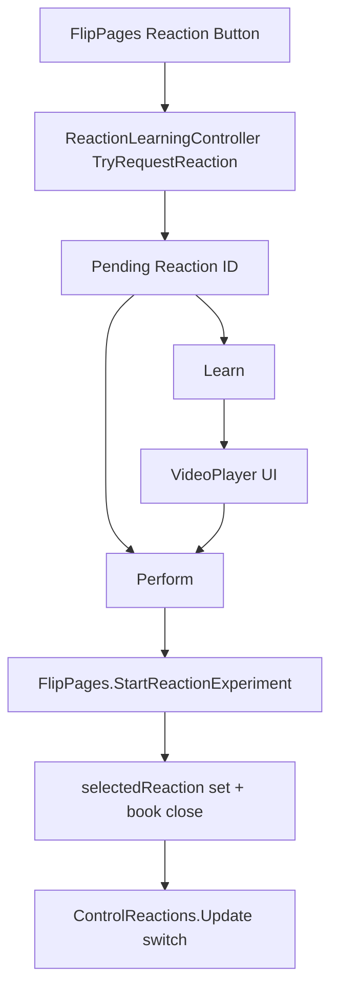

# ATOMIX VIDEO FEATURE IMPLEMENTATION

## 1. Executive Summary

- **Implementation status:** Implemented in code and data assets (desktop flow).
- **Feature implemented:** Pending reaction + Learn/Perform choice + molecular video playback (Play/Pause/Replay/Back/Perform).
- **Unity project root used:** `Atomix/VR`
- **Scene(s) affected at runtime:** `Assets/Scenes/LabScene.unity` (no scene YAML edited; behavior injected from scripts at runtime).
- **Videos discovered:** 6
- **Videos mapped:** 6/8 confidently
- **Videos assigned by agent:** 6/8 in `Assets/Resources/ReactionLearningVideoCatalog.asset`
- **Videos requiring manual assignment now:** 0 (for current 6)
- **Missing videos:** Reaction 1 (Sodium + Water), Reaction 8 (Iron Sulfate decomposition)
- **Compilation status:** Could not run C# build in this environment (`dotnet` SDK and `msbuild` unavailable)
- **Play Mode status:** Not executed in this environment
- **Manual tasks remaining:** Play Mode verification + future assignment of the remaining 2 clips

## 2. Before vs After

**BEFORE**

Book -> Reaction -> Experiment

**AFTER**

Book -> Reaction -> Learn / Perform

Learn -> Molecular Video -> Replay / Back / Perform

Perform -> Existing Experiment

## 3. Complete Player Flow

Launch -> Lab -> Open book -> Select reaction -> Learn/Perform panel appears.

- **Learn:** Opens molecular video for pending reaction (if available), with Play/Pause/Replay/Back/Perform.
- **Perform:** Starts the original reaction path (`FlipPages.selectedReaction` + close book -> `ControlReactions.Update`).
- **Back from choice:** Returns to reaction selection state with no experiment start.
- **Back from video:** Stops video playback, closes video view, returns to choice view, no experiment start.

## 4. Files Created

1. `Assets/Scripts/ReactionLearningController.cs`  
   - Purpose: Shared Learn/Perform + video flow controller (desktop UI invokes shared logic).
   - Class: `ReactionLearningController`
   - Important methods:
     - `GetOrCreate(FlipPages)`
     - `TryRequestReaction(int)`
     - `NotifyBookClosed(Scene)`
     - `OnLearnClicked`, `OnPerformClicked`, `TogglePlayPause`, `OnReplayClicked`
   - Dependencies: `FlipPages`, `FirstPersonController`, `VideoPlayer`, `UGUI`, `TextMeshPro`, `ReactionLearningVideoCatalog`.

2. `Assets/Scripts/ReactionLearningVideoCatalog.cs`  
   - Purpose: Serialized reaction/video mapping for all 8 reactions.
   - Class: `ReactionLearningVideoCatalog` (+ nested `Entry`)
   - Important methods:
     - `TryGetEntry(int, out Entry)`
   - Dependencies: `UnityEngine.Video.VideoClip`.

3. `Assets/Resources/ReactionLearningVideoCatalog.asset`  
   - Purpose: Data mapping asset (8 entries, 6 clips assigned, 2 null).

4. Meta files created:
   - `Assets/Scripts/ReactionLearningController.cs.meta`
   - `Assets/Scripts/ReactionLearningVideoCatalog.cs.meta`
   - `Assets/Resources.meta`
   - `Assets/Resources/ReactionLearningVideoCatalog.asset.meta`

## 5. Files Modified

1. `Assets/Scripts/FlipPages.cs`
   - Original responsibility: Book page navigation + reaction selection (`Reaction1..Reaction8`) by setting `selectedReaction` and closing book.
   - Exact modification:
     - Added learn-flow interception:
       - `TryOpenReactionLearningFlow(int reactionId)`
     - Added preserved experiment trigger method:
       - `StartReactionExperiment(int reactionId)` (old path encapsulated)
     - Updated `Reaction1..Reaction8` to open Learn/Perform first, fallback to old behavior if controller unavailable.
     - `closeTheBook()` now notifies learning controller to stop/hide any active video UI.
   - Reason: Introduce pending-reaction state without breaking original reaction startup path.
   - Regression risk: Low-medium (selection entrypoint changed; perform path intentionally preserved).

2. `Assets/Scripts/BookCanvasManager.cs`
   - Original responsibility: Open/close book and cursor lock transition.
   - Exact modification:
     - `CloseBook()` now calls `ReactionLearningController.NotifyBookClosed(scene)` before hiding the book.
   - Reason: Ensure video playback/UI always stops when book closes (including `B` toggle path).
   - Regression risk: Low.

## 6. Scenes/Prefabs Modified

- **Scene YAML edits:** None
- **Prefab edits:** None
- **Runtime-created GameObjects (by script):**
  - `ReactionLearningController`
  - `ReactionLearningPanel`
  - `ReactionVideoDisplay` (+ `VideoPlayer`, `AudioSource`)
  - Runtime UI buttons/text objects under the book canvas

## 7. All 8 Reactions Mapping

| Reaction ID | Reaction Name/Equation | Existing Script/System | Video Folder | Video File | Assignment Status |
|---|---|---|---|---|---|
| 1 | 2Na + 2H2O -> 2NaOH + H2 | `Reaction.cs` + `ControlReactions.StartReaction1()` | N/A | N/A | VIDEO NOT YET PROVIDED |
| 2 | H2SO4 + CuO -> CuSO4 + H2O | `Reaction_h2so4_cuo.cs` + `StartReaction2()` | `Assets/H₂SO₄ + CuO → CuSO₄ + H₂O/` | `Video Project.mp4` | Assigned |
| 3 | HCl + NaHCO3 -> NaCl + H2O + CO2 | `Reaction_hcl_nahco3.cs` + `StartReaction3()` | `Assets/HCl + NaHCO₃ → NaCl + H₂O + CO₂↑/` | `Video Project.mp4` | Assigned |
| 4 | 2K + 2H2O -> 2KOH + H2 | `KOHReaction.cs` + `StartReaction4()` | `Assets/2K+2H2​O→2KOH+H2​↑/` | `KOH.mp4` | Assigned |
| 5 | Al + I -> AlI3 | `ReactionAli3.cs` + `StartReaction5()` | `Assets/Al + I/` | `Video Project.mp4` | Assigned |
| 6 | CaO + H2O -> Ca(OH)2 | `reactionCaOH.cs` + `StartReaction6()` | `Assets/Cao + H2O/` | `Video Project.mp4` | Assigned |
| 7 | CaCO3 -> CaO + CO2 | `CaCO3Reaction.cs` + `StartReaction7()` | `Assets/CaCO₃ (Δ) → CaO + CO₂/` | `Video Project.mp4` | Assigned |
| 8 | FeSO4 -> Fe2O3 + SO2 + SO3 | `Feso4Reaction.cs` + `StartReaction8()` | N/A | N/A | VIDEO NOT YET PROVIDED |

## 8. Current Video Inventory

1. `Assets/H₂SO₄ + CuO → CuSO₄ + H₂O/Video Project.mp4`  
   - Identity: Reaction 2  
   - Confidence: High  
   - Assignment: Done (catalog)

2. `Assets/HCl + NaHCO₃ → NaCl + H₂O + CO₂↑/Video Project.mp4`  
   - Identity: Reaction 3  
   - Confidence: High  
   - Assignment: Done (catalog)

3. `Assets/Cao + H2O/Video Project.mp4`  
   - Identity: Reaction 6  
   - Confidence: High  
   - Assignment: Done (catalog)

4. `Assets/CaCO₃ (Δ) → CaO + CO₂/Video Project.mp4`  
   - Identity: Reaction 7  
   - Confidence: High  
   - Assignment: Done (catalog)

5. `Assets/Al + I/Video Project.mp4`  
   - Identity: Reaction 5  
   - Confidence: High  
   - Assignment: Done (catalog)

6. `Assets/2K+2H2​O→2KOH+H2​↑/KOH.mp4`  
   - Identity: Reaction 4  
   - Confidence: High  
   - Assignment: Done (catalog)

## 9. Architecture

Book (`FlipPages`)  
-> Reaction requested  
-> Pending reaction (`ReactionLearningController.pendingReactionId`)  
-> Learn / Perform  
-> Learn = video flow, Perform = original reaction path

Ownership:
- pending reaction: `ReactionLearningController`
- mapping: `ReactionLearningVideoCatalog` asset
- UI: runtime-created panel in `ReactionLearningController`
- VideoPlayer: runtime-created on `ReactionVideoDisplay`
- Perform trigger: `ReactionLearningController.OnPerformClicked()` -> `FlipPages.StartReactionExperiment()`

## 10. Video Player

- **VideoPlayer component:** Runtime-created on `ReactionVideoDisplay`.
- **Clip assignment source:** `ReactionLearningVideoCatalog.asset`.
- **Rendering:** `VideoPlayer -> RenderTexture(1280x720) -> RawImage`.
- **Audio:** `VideoPlayer` audio track routed to runtime `AudioSource`.
- **Controls implemented:** Play/Pause, Replay, Back, Perform.
- **Completion behavior:** No auto-start of reaction; stays in user-controlled state.
- **Missing video behavior:** Displays unavailability message with Perform/Back options.

## 11. Desktop Input

- While Learn/Perform UI is shown, controller forces cursor unlocked (`FirstPersonController.SetCursorLock(false)`).
- UI is clickable with mouse.
- On book close / perform, existing book flow restores gameplay cursor lock via `BookCanvasManager.CloseBook()`.
- Keyboard convenience implemented:
  - `Escape` -> Back behavior based on current learn UI state
  - `Space` -> Play/Pause while in video view

## 12. Existing Reaction Integration

Perform path is preserved through original reaction trigger mechanism:
1. `ReactionLearningController.OnPerformClicked()`
2. `FlipPages.StartReactionExperiment(reactionId)`
3. Sets `FlipPages.selectedReaction = reactionId`
4. Calls existing `FlipPages.closeTheBook()`
5. `ControlReactions.Update()` detects `selectedReaction` and runs existing `StartReactionX()` logic

No chemistry setup was duplicated in the new feature.

## 13. Inspector/Serialized Configuration

Primary configuration asset:
- `Assets/Resources/ReactionLearningVideoCatalog.asset`
  - Script: `ReactionLearningVideoCatalog`
  - Field: `entries[]`
  - Per-entry fields:
    - `reactionId`
    - `reactionName`
    - `displayTitle`
    - `videoClip`

No mandatory scene/prefab inspector wiring was required for this implementation.

## 14. Current Six Videos Assignment Status

1. Reaction 2 -> `Assets/H₂SO₄ + CuO → CuSO₄ + H₂O/Video Project.mp4`  
   **DONE BY AGENT**

2. Reaction 3 -> `Assets/HCl + NaHCO₃ → NaCl + H₂O + CO₂↑/Video Project.mp4`  
   **DONE BY AGENT**

3. Reaction 4 -> `Assets/2K+2H2​O→2KOH+H2​↑/KOH.mp4`  
   **DONE BY AGENT**

4. Reaction 5 -> `Assets/Al + I/Video Project.mp4`  
   **DONE BY AGENT**

5. Reaction 6 -> `Assets/Cao + H2O/Video Project.mp4`  
   **DONE BY AGENT**

6. Reaction 7 -> `Assets/CaCO₃ (Δ) → CaO + CO₂/Video Project.mp4`  
   **DONE BY AGENT**

# HOW TO ADD THE REMAINING TWO REACTION VIDEOS

Missing reactions:
- **Reaction ID 1:** 2Na + 2H2O -> 2NaOH + H2
- **Reaction ID 8:** FeSO4 -> Fe2O3 + SO2 + SO3

Recommended folder names:
- `Assets/2Na+2H2O→2NaOH+H2/`
- `Assets/FeSO4 (Δ) → Fe2O3 + SO2 + SO3/`

## Step 1 — Create/add folder
Create the folder under `Atomix/VR/Assets/` for each missing reaction video.

## Step 2 — Add video
Place the `.mp4` file inside each folder.

## Step 3 — Unity import
Open Unity and wait until import/refresh completes (progress bar finishes).

## Step 4 — Find configuration
Open asset:  
`Assets/Resources/ReactionLearningVideoCatalog.asset`

## Step 5 — Find reaction
In `entries`:
- Locate `reactionId: 1`
- Locate `reactionId: 8`

## Step 6 — Assign VideoClip
Drag imported `VideoClip` from Project window into:
- `entries[Reaction 1].videoClip`
- `entries[Reaction 8].videoClip`

## Step 7 — Save
Save project (`Ctrl+S`) so asset changes persist.

## Step 8 — Test
Run:
Book -> Reaction 1 -> Learn (video should open)  
Book -> Reaction 8 -> Learn (video should open)

## Step 9 — Troubleshooting
- If unavailable message still appears: verify `videoClip` is assigned on correct reaction ID.
- If video does not display: ensure `VideoClip` imported successfully and no console playback errors.
- If video has no audio: check imported clip audio track and Unity audio output.
- If wrong video plays: confirm `reactionId` entry mapping in catalog.
- If Inspector reference missing: re-open `ReactionLearningVideoCatalog.asset` and reassign clip.

## 16. Manual Tasks Required From Developer

1. Open Unity project `Atomix/VR`.
2. Enter `LabScene`.
3. Enter Play Mode and run the full checklist in section 17.
4. Add and assign the 2 missing videos (section 15) when they are provided.

## 17. Test Checklist

### Core
- [ ] Project compiles
- [ ] Lab loads
- [ ] Desktop movement
- [ ] Mouse look
- [ ] Book opens
- [ ] Book navigation

### Reactions 1–8
- [ ] Selection
- [ ] Correct title
- [ ] Learn
- [ ] Perform
- [ ] Back

### Current videos (6 available)
- [ ] Correct video
- [ ] Video visible
- [ ] Audio if applicable
- [ ] Pause
- [ ] Resume
- [ ] Replay
- [ ] Back
- [ ] Perform

### Missing videos (2 reactions)
- [ ] Unavailable state
- [ ] No exception
- [ ] Back
- [ ] Perform

### Existing gameplay
- [ ] Correct experiment
- [ ] Grabbing
- [ ] Pouring
- [ ] Reaction detection
- [ ] VFX
- [ ] Animation
- [ ] Audio
- [ ] Completion

### Regression
- [ ] Inworld unaffected
- [ ] XR settings unaffected
- [ ] Existing VR code not intentionally broken

## 18. Verification Results

| Test | Result | Notes |
|---|---|---|
| Reaction selection interception (`FlipPages`) | STATICALLY VERIFIED | `Reaction1..8` now route through learn controller first |
| Original perform path preserved | STATICALLY VERIFIED | Perform calls `StartReactionExperiment` -> `selectedReaction` -> `ControlReactions.Update` |
| Video mapping data for 8 entries | STATICALLY VERIFIED | Catalog asset contains 8 entries with 6 clips assigned, 2 null |
| Missing-video safe flow | STATICALLY VERIFIED | Explicit unavailable UI path implemented |
| Video stop on book close | STATICALLY VERIFIED | `NotifyBookClosed` called from `FlipPages.closeTheBook` and `BookCanvasManager.CloseBook` |
| C# compilation command | FAILED | `dotnet` SDK and `msbuild` unavailable in environment |
| Play Mode validation | REQUIRES MANUAL TEST | Unity Editor Play Mode not available in this environment |

## 19. Known Issues

- Runtime/Play Mode behavior is unverified here (manual Unity validation required).
- Two reaction videos are still missing by content (Reaction 1 and 8).
- Build verification via CLI could not run due missing SDK/build tools.

## 20. Rollback

To restore old behavior:
1. Remove files:
   - `Assets/Scripts/ReactionLearningController.cs`
   - `Assets/Scripts/ReactionLearningVideoCatalog.cs`
   - `Assets/Resources/ReactionLearningVideoCatalog.asset`
   - associated `.meta` files
2. Revert modified files:
   - `Assets/Scripts/FlipPages.cs`
   - `Assets/Scripts/BookCanvasManager.cs`
3. No scene/prefab rollback needed (none edited).
4. Existing video files can remain in `Assets/` safely.

## 21. Future VR Support (Not Implemented Now)

VR can call the same shared controller APIs without rewriting video logic:
- `ReactionLearningController.GetOrCreate(flipPages)`
- `TryRequestReaction(reactionId)` for Learn/Perform entry
- Perform path remains shared via `FlipPages.StartReactionExperiment(reactionId)`

Target architecture already aligns with:

Desktop UI -> Shared Controller <- Future XR UI  
Shared Controller -> Shared VideoPlayer flow

## 22. Next Steps

1. Open Unity and run Play Mode.
2. Validate one reaction end-to-end (selection -> learn -> perform).
3. Validate all six currently assigned videos.
4. Validate missing-video fallback for reactions 1 and 8.
5. Validate Perform path for all 8 reactions.
6. Regression-test desktop chemistry flow.
7. Confirm Inworld/VR behavior unchanged.
8. Add videos for reactions 1 and 8 when available (no C# changes needed).
9. Re-test and finalize.
