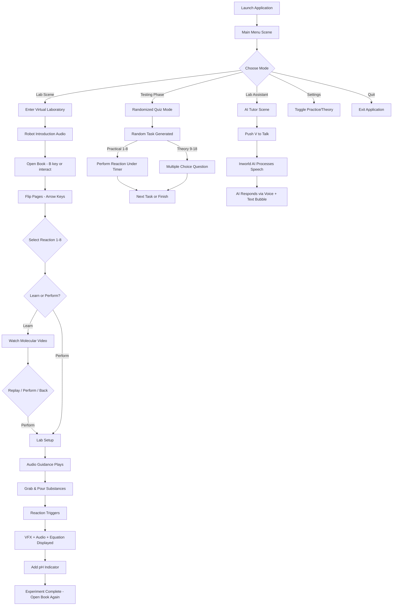
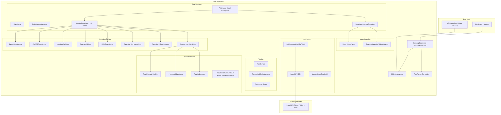
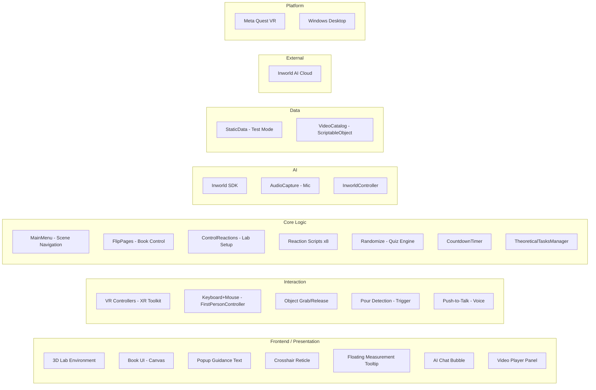

# ATOMIX — COMPLETE PROJECT FORENSIC ANALYSIS

---

## Executive Summary

**Atomix** is a Unity-based **virtual chemistry laboratory** built primarily for **VR (Meta Quest / OpenXR)** with a runtime **desktop keyboard+mouse fallback**. It allows students to perform 8 real chemistry experiments in a 3D laboratory environment, learn about molecular reactions through embedded video explanations, take randomized theory+practice quizzes, and converse with an **AI Lab Assistant powered by Inworld AI** using push-to-talk voice interaction.

| Attribute | Value |
|---|---|
| **Unity Version** | 6000.3.7f1 (Unity 6) |
| **Primary Platform** | Meta Quest (Oculus) VR via OpenXR |
| **Secondary Platform** | Windows Desktop (keyboard+mouse) |
| **AI Provider** | Inworld AI SDK v3.3.1 |
| **Total C# Scripts** | 55 files |
| **Total Scenes** | 4 |
| **Total Reactions** | 8 practical + 10 theoretical questions |
| **Render Pipeline** | Built-in (BiRP) |
| **Project Status** | Functional prototype / academic project |

> [!IMPORTANT]
> **Evidence Classification**: Throughout this report, claims are tagged **CONFIRMED** (direct code/config evidence), **INFERRED** (strongly implied), **UNVERIFIED** (cannot confirm), or **MISSING** (information unavailable).

---

## 1. Project Overview

### Simple Explanation
Atomix is a virtual science lab that lives inside a VR headset (or a regular computer). Think of it as a video game where, instead of fighting enemies, you perform real chemistry experiments—pouring water, adding chemicals, watching reactions explode—all in a safe digital space. An AI robot assistant can answer your chemistry questions using your voice.

### Technical Explanation
Atomix is a Unity 6 application targeting Oculus/OpenXR headsets with a runtime-injected desktop mode. It simulates 8 inorganic chemistry reactions through trigger-based collision detection (not physics-based fluid simulation), provides pre-recorded molecular explanation videos via `VideoPlayer`, implements a randomized quiz/testing system, and integrates Inworld AI's conversational character SDK for a voice-interactive lab assistant NPC.

### Evidence
- [CONFIRMED] Unity version: `6000.3.7f1` — [ProjectVersion.txt](file:///c:/Users/karti/Desktop/All%20Desktop%20Apps/Atomix_new/VR/ProjectSettings/ProjectVersion.txt)
- [CONFIRMED] Inworld AI SDK: `com.inworld.unity.core-3.3.1.tgz` — [manifest.json](file:///c:/Users/karti/Desktop/All%20Desktop%20Apps/Atomix_new/VR/Packages/manifest.json)
- [CONFIRMED] Oculus/OpenXR: `Unity.XR.Oculus.Settings`, `OpenXRLoader.asset` — [EditorBuildSettings.asset](file:///c:/Users/karti/Desktop/All%20Desktop%20Apps/Atomix_new/VR/ProjectSettings/EditorBuildSettings.asset)

---

## 2. Atomix in Plain English

Imagine walking into a chemistry lab, but instead of it being a real room, it exists inside your VR headset. You're standing at a lab bench, surrounded by beakers, test tubes, Bunsen burners, and bottles of chemicals—all rendered in 3D.

On the desk is a **book**. You open it, and it shows categories of chemical reactions: Decomposition, Displacement, Redox, Neutralization, Precipitation, and Combustion. You flip through pages and pick a reaction—say, "adding sodium to water."

Before performing the experiment, Atomix offers you two options:
- **LEARN**: Watch a molecular-level video that explains what happens at the atomic scale
- **PERFORM**: Jump straight into the virtual experiment

If you choose PERFORM, the lab table populates with the exact glassware and chemicals you need. A popup text box and an audio voice guide you through step-by-step: "Grab the Erlenmeyer beaker of water and pour it into the Berzelius beaker." You physically pick up the beaker (with your VR controller or mouse), tilt it, and watch the water pour. Then you add sodium. An explosion particle effect fires, a sound plays, and the text tells you the chemical equation.

In a separate scene, a robot-like **AI Lab Assistant** waits for you. You hold a button and speak naturally—"Why does sodium explode in water?"—and the AI answers using real-time voice synthesis powered by Inworld AI.

There's also a **testing mode** where you're given random reactions to perform under a countdown timer, mixed with multiple-choice theory questions like "What color does phenolphthalein turn in a basic solution?"

---

## 3. Project Goals

| Goal | Evidence | Confidence |
|---|---|---|
| Simulate chemistry experiments in VR | 8 reaction scripts, laboratory 3D models | CONFIRMED |
| Provide educational chemistry content | Theory questions, experiment sheets, audio guidance | CONFIRMED |
| Integrate AI conversational tutoring | Inworld AI SDK, LabAssistantScene, push-to-talk UI | CONFIRMED |
| Support both VR and desktop modes | DesktopBootstrap.cs, FirstPersonController.cs, XR Rig | CONFIRMED |
| Include molecular-level learning videos | ReactionLearningController.cs, 6 MP4 video files | CONFIRMED |
| Assess student knowledge | Randomize.cs, TheoreticalTasksManager.cs, CountdownTimer | CONFIRMED |

---

## 4. Target Users

- **Primary**: Chemistry students (high school / early university level)
- **Secondary**: Chemistry teachers and lab instructors
- **Tertiary**: Educational researchers studying VR/AI-assisted learning

**Evidence**: The reaction types (decomposition, neutralization, displacement, redox) and the theory questions (phenolphthalein color, reaction type identification) align with typical secondary-school/pre-university inorganic chemistry curricula. [INFERRED from reaction content in TheoreticalTasksManager.cs]

---

## 5. Complete Feature Inventory

### Feature 1: Virtual Chemistry Laboratory (8 Reactions)
| Attribute | Detail |
|---|---|
| **Purpose** | Perform hands-on chemistry experiments in 3D |
| **Status** | Fully implemented |
| **Scripts** | `Reaction.cs`, `Reaction_h2so4_cuo.cs`, `Reaction_hcl_nahco3.cs`, `KOHReaction.cs`, `ReactionAli3.cs`, `reactionCaOH.cs`, `CaCO3Reaction.cs`, `Feso4Reaction.cs`, `ControlReactions.cs` |
| **Interaction** | Pick up beakers → pour substances → trigger reaction → visual/audio feedback |
| **Reactions** | See Section 12 for complete list |

### Feature 2: Reaction Book / Selection UI
| Attribute | Detail |
|---|---|
| **Purpose** | Browse and select reactions by category |
| **Status** | Fully implemented |
| **Scripts** | `FlipPages.cs`, `BookCanvasManager.cs`, `OpenTheBook.cs` |
| **Categories** | Decomposition, Displacement, Neutralization, Redox, Precipitation, Combustion |
| **Interaction** | Open book → flip pages → click reaction button (or press 1-8 on keyboard) |

### Feature 3: Learn-Before-You-Perform Video System
| Attribute | Detail |
|---|---|
| **Purpose** | Show molecular-level explanation videos before experiments |
| **Status** | Fully implemented (6/8 videos assigned; 2 missing) |
| **Scripts** | `ReactionLearningController.cs`, `ReactionLearningVideoCatalog.cs` |
| **Data** | `Assets/Resources/ReactionLearningVideoCatalog.asset` |
| **Missing** | Videos for Reaction 1 (Na+H2O) and Reaction 8 (FeSO4 decomposition) |

### Feature 4: AI Lab Assistant (Inworld AI)
| Attribute | Detail |
|---|---|
| **Purpose** | Voice-interactive AI tutor that answers chemistry questions |
| **Status** | Fully implemented (requires Inworld API connection) |
| **Scripts** | `LabAssistantPushToTalkUI.cs`, `LabAssistantSubtitleUI.cs` |
| **Scene** | `LabAssistantScene` |
| **Interaction** | Hold V key → speak → AI responds with voice + text bubble |
| **Dependency** | Inworld AI cloud service (requires API key and internet) |

### Feature 5: Randomized Testing / Quiz Mode
| Attribute | Detail |
|---|---|
| **Purpose** | Assess student knowledge through randomized practical + theory tasks |
| **Status** | Fully implemented |
| **Scripts** | `Randomize.cs`, `TheoreticalTasksManager.cs`, `CountdownTimer.cs` |
| **Scene** | `TestingPhaseLab` |
| **Question Count** | 8 practical + 10 theoretical = 18 total tasks |
| **Settings** | Practice only (0), Theory only (1), Both (2) — via `StaticData.includedTasksValue` |

### Feature 6: Desktop Mode (Keyboard + Mouse)
| Attribute | Detail |
|---|---|
| **Purpose** | Allow non-VR users to experience the lab |
| **Status** | Fully implemented |
| **Scripts** | `DesktopBootstrap.cs`, `FirstPersonController.cs`, `ObjectInteraction.cs`, `ObjectGrabbable.cs`, `DesktopCrosshairUI.cs`, `ControlsHelpUI.cs` |
| **Initialization** | `[RuntimeInitializeOnLoadMethod]` auto-injects desktop mode at scene load |

### Feature 7: Intelligent Proportions System
| Attribute | Detail |
|---|---|
| **Purpose** | Validate that students use correct chemical ratios |
| **Status** | Implemented for Reaction 1 (Sodium + Water) |
| **Script** | `Reaction.cs` (lines 24-31) |
| **Mechanic** | Tracks water poured (ml) and sodium added (g) in real-time; fails if outside 5% tolerance |
| **Feedback** | Floating 3D tooltip shows live measurements; suggests asking AI about failures |

### Feature 8: Experiment Sheets
| Attribute | Detail |
|---|---|
| **Purpose** | Display experiment documentation alongside each reaction |
| **Status** | Fully implemented (8 sheets, one per reaction) |
| **Script** | `ControlReactions.cs` (experimentSheet1-8 GameObjects) |

### Feature 9: Audio Guidance System
| Attribute | Detail |
|---|---|
| **Purpose** | Voice-narrated step-by-step instructions for each reaction |
| **Status** | Fully implemented |
| **Assets** | 39 audio files in `Assets/Sounds/` |
| **Script** | `ControlReactions.cs`, individual reaction scripts |

### Feature 10: Main Menu with Settings
| Attribute | Detail |
|---|---|
| **Purpose** | Navigate between scenes, configure test mode |
| **Status** | Fully implemented |
| **Script** | `MainMenu.cs` |
| **Options** | Lab Scene, Testing Phase, Lab Assistant, Settings, Quit |

---

## 6. User Journey



### First-Time User Experience
1. **Launch** → Main menu appears with options
2. **Enter Lab** → Robot voice introduces the lab
3. **Prompted** to open the book (text popup + audio)
4. **Book opens** → See "Decomposition Reactions" page with 2 reaction buttons
5. **Select reaction** → Learn/Perform choice appears
6. **Perform** → Lab populates with correct equipment, guidance audio plays
7. **Interact** → Grab beakers, pour substances, watch results
8. **Complete** → Popup confirms success, can try another reaction

---

## 7. System Architecture

### High-Level Architecture



---

## 8. Unity Architecture

### Unity Version
**CONFIRMED**: Unity 6000.3.7f1 (Unity 6, LTS-track)

### Render Pipeline
**CONFIRMED**: Built-in Render Pipeline (BiRP). Evidence: `GraphicsSettings.asset` does not reference URP or HDRP asset; Shader Graph files present but compatible with BiRP via Shader Graph package.

### Scenes (4 total, all in build)

| # | Scene | Purpose | Size |
|---|---|---|---|
| 0 | `MainMenuScene` | Entry point, navigation, settings | 1.58 MB |
| 1 | `LabScene` | Primary experiment laboratory | 3.69 MB |
| 2 | `TestingPhaseLab` | Randomized quiz/exam mode | 3.41 MB |
| 3 | `LabAssistantScene` | AI tutor conversation | 0.57 MB |

### XR Configuration
- **CONFIRMED**: Oculus Loader — `Assets/XR/Loaders/OculusLoader.asset`
- **CONFIRMED**: OpenXR Loader — `Assets/XR/Loaders/OpenXRLoader.asset`
- **CONFIRMED**: Mock HMD Loader — `Assets/XR/Loaders/MockHMDLoader.asset` (for editor testing)
- **CONFIRMED**: `Unity.XR.Oculus.Settings` referenced in build settings
- **CONFIRMED**: Android build support configured — `BurstAotSettings_Android.json`

### Singleton / DontDestroyOnLoad Usage
- `DesktopBootstrap` — **CONFIRMED** DontDestroyOnLoad singleton (`Initialize()` method)
- `ReactionLearningController` — **CONFIRMED** static instance field (soft singleton, not DontDestroyOnLoad)
- `StaticData` — **CONFIRMED** uses static field for cross-scene persistence (not a singleton pattern)

### Key Architectural Decisions
1. **Runtime Desktop Injection** [CONFIRMED]: Rather than having separate desktop/VR scenes, `DesktopBootstrap` uses `[RuntimeInitializeOnLoadMethod]` to automatically add FPS controller, crosshair, interaction system, and disable XR behaviours at runtime.
2. **Crosshair-Based UI** [CONFIRMED]: Desktop mode locks the cursor and shoots raycasts from screen center, simulating VR controller pointing.
3. **Reaction Setup via GameObject Activation** [CONFIRMED]: Each reaction activates/deactivates specific GameObjects (beakers, containers, etc.) rather than instantiating prefabs.
4. **No Scene Additive Loading** [CONFIRMED]: Scene transitions use `SceneManager.LoadScene()` (full replacement).

---

## 9. Scene Architecture

### LabScene Hierarchy (Inferred from script references)

```mermaid
graph TD
    Root["LabScene Root"]
    Root --> XR["XR Rig (Camera, Controllers)"]
    Root --> Lab["Laboratory Environment (laborator.fbx)"]
    Root --> Desk["Lab Desks (pupitru1.fbx, desk.fbx)"]
    Root --> Book["Book Object (book.fbx)"]
    Root --> BCan["Book Canvas (UI)"]
    Root --> Popup["Popup Window (UI)"]
    Root --> Audio["Audio Sources"]
    
    subgraph "Reaction 1 Objects"
        R1W["Water Erlenmeyer"]
        R1Na["Natrium Container"]
        R1Ph["Phenolphthalein Container"]
        R1NaOH["NaOH Berzelius"]
    end
    
    subgraph "Reaction 7 Objects"
        R7BB["Bunsen Burner"]
        R7TT["Test Tube + Support"]
        R7B["Balloon"]
    end
    
    Root --> R1W & R1Na & R1Ph & R1NaOH
    Root --> R7BB & R7TT & R7B
```



---

## 10. Codebase Analysis

### Script Inventory (55 C# files)

| Script | Lines | Responsibility | Coupling |
|---|---|---|---|
| `ReactionLearningController.cs` | 1962* | Video learning UI + playback | FlipPages, VideoCatalog |
| `ControlReactions.cs` | 619 | Activate/deactivate lab objects per reaction | FlipPages |
| `FlipPages.cs` | 539 | Book page navigation + reaction selection | RLC, BookCanvasManager |
| `ObjectInteraction.cs` | 474 | Desktop grab/release/UI interaction | ObjectGrabbable, DesktopCrosshairUI |
| `DesktopBootstrap.cs` | 461 | Runtime desktop mode injection | Many (reflection-based) |
| `Randomize.cs` | 339 | Random test task generation | CountdownTimer, TheoreticalTasksManager |
| `Reaction.cs` | 288 | Sodium + water reaction logic | PourSubstance, PourMetalSubstance |
| `FirstPersonController.cs` | 293 | WASD movement + mouse look | CharacterController |
| `LabAssistantSubtitleUI.cs` | 232 | Adjust Inworld chat bubble readability | TMP_Text, Canvas |
| `LabAssistantPushToTalkUI.cs` | 371 | Push-to-talk mic controls | InworldController |
| `TheoreticalTasksManager.cs` | 176 | Theory quiz questions + grading | Randomize |
| `MainMenu.cs` | 116 | Scene navigation + settings | StaticData |
| `BookCanvasManager.cs` | 88 | Book open/close + cursor management | RLC, FirstPersonController |

*\*Includes ~600 lines of commented-out previous version*

### Code Quality Assessment

| Category | Score /10 | Reason |
|---|---|---|
| **Architecture** | 5 | Functional but heavily coupled; no interfaces, DI, or event bus |
| **Maintainability** | 4 | Massive `ControlReactions.cs` with 8 nearly-identical methods; no data-driven setup |
| **Readability** | 6 | Clear naming, some Romanian variable names (`timpInitial`, `titlu`, `dulap`, `chiuveta`) |
| **Performance** | 5 | `Update()` polling in ControlReactions, DateTime.Now usage, excessive `FindObjectsByType` |
| **Security** | 3 | Inworld API key handling unverified; no input sanitization for AI prompts |
| **Error Handling** | 4 | Some null checks; no try-catch around external API calls |
| **Testing** | 1 | No automated tests found |
| **Modularity** | 3 | Reaction logic duplicated across 8+ scripts instead of data-driven pattern |

### Identified Code Smells

1. **Massive duplication in `ControlReactions.cs`**: 8 `StartReactionX()` methods each contain ~60 identical lines toggling GameObjects. Should be data-driven.
2. **`DateTime.Now` for timing**: Used in `Reaction.cs` and `TheoreticalTasksManager.cs` instead of `Time.time` — not frame-rate-independent, won't respect Time.timeScale.
3. **`GameObject.Find()` in `Randomize.cs`**: 30+ calls to `GameObject.Find()` in `Start()` — fragile, will silently fail if objects are renamed.
4. **1962-line `ReactionLearningController.cs`**: Contains ~630 lines of commented-out previous implementation — dead code that should be removed.
5. **`StaticData.cs`** uses a `MonoBehaviour` with only a static field — should be a plain static class.
6. **Romanian-English mixed naming**: `timpInitial`, `titlu1`, `continua`, `buton1`, `dulap`, `chiuveta`, `eprubeta` mixed with English names.

---

## 11. Major Subsystems

### 11.1 Reaction Simulation System

**Purpose**: Simulate chemistry experiments through object interaction and state tracking.

**How it works**: Each reaction has a dedicated MonoBehaviour script that monitors boolean flags set by "Pour" scripts. When substances meet the trigger conditions (e.g., `water.containsWater == true && metal.containsNatrium == true`), the reaction fires: particle effects play, audio triggers, and instructional text appears.

**Components**: 8 reaction scripts + 8 pour scripts + ControlReactions orchestrator

**Limitations**:
- No physics-based fluid simulation — pouring is collision-trigger-based
- Reactions are binary states, not continuous chemistry simulations
- No temperature, pressure, or concentration modeling (except Reaction 1's intelligent proportions)

### 11.2 Desktop Bootstrap System

**Purpose**: Make the VR-designed scenes playable with keyboard+mouse without modifying scene files.

**How it works**: `DesktopBootstrap` uses `[RuntimeInitializeOnLoadMethod]` to run after every scene load. It:
1. Disables all XR-related behaviours (via string matching on type names)
2. Attaches `FirstPersonController` to the main camera
3. Attaches `ObjectInteraction` for grab/release
4. Uses reflection to scan all MonoBehaviour fields for GameObject references and adds `ObjectGrabbable` components
5. Attaches special interactables to Bunsen burner buttons, container lids, book objects

**Evidence**: [DesktopBootstrap.cs](file:///c:/Users/karti/Desktop/All%20Desktop%20Apps/Atomix_new/VR/Assets/Scripts/DesktopBootstrap.cs)

### 11.3 AI Lab Assistant System

**Purpose**: Provide a voice-interactive AI chemistry tutor.

**Technology**: Inworld AI SDK v3.3.1

**How it works**:
1. User enters `LabAssistantScene`
2. `LabAssistantPushToTalkUI` sets Inworld to manual audio mode (`ManualAudioHandling = true`, `AutoPush = false`)
3. User holds V key → `InworldController.Instance.StartAudio()` captures microphone
4. User releases V → `InworldController.Instance.PushAudio()` sends audio to Inworld cloud
5. Inworld processes speech-to-text → generates response via its character AI → returns voice audio + text
6. `LabAssistantSubtitleUI` adjusts the world-space chat bubble for desktop readability

**Cloud Dependency**: [CONFIRMED] Requires active Inworld cloud connection. `requireConnectedSession = true` by default.

**What the AI knows**: [UNVERIFIED] — The Inworld character configuration is stored in `Assets/Inworld/UserData/` and the actual character personality/knowledge is configured in Inworld Studio (cloud dashboard). The exact system prompt and knowledge base cannot be determined from the local project files alone.

### 11.4 Video Learning System

**Purpose**: Show molecular-level explanation videos before experiments.

**Architecture**: Documented extensively in [ATOMIX_VIDEO_FEATURE_IMPLEMENTATION.md](file:///c:/Users/karti/Desktop/All%20Desktop%20Apps/Atomix_new/VR/ATOMIX_VIDEO_FEATURE_IMPLEMENTATION.md)

**Flow**: Book → Select Reaction → Learn/Perform choice → VideoPlayer → RenderTexture → RawImage

---

## 12. Chemistry Simulation — Complete Reaction Table

| ID | Reaction | Equation | Type | Equipment | Script |
|---|---|---|---|---|---|
| 1 | Sodium + Water | 2Na + 2H₂O → 2NaOH + H₂ | Displacement | Water beaker, Na container, phenolphthalein, NaOH berzelius | `Reaction.cs` |
| 2 | Sulfuric Acid + Copper Oxide | H₂SO₄ + CuO → CuSO₄ + H₂O | Neutralization | H2SO4 erlenmeyer, CuO container, CuSO4 berzelius | `Reaction_h2so4_cuo.cs` |
| 3 | HCl + Sodium Bicarbonate | HCl + NaHCO₃ → NaCl + H₂O + CO₂↑ | Double Displacement | HCl erlenmeyer, NaHCO3 container, NaCl berzelius | `Reaction_hcl_nahco3.cs` |
| 4 | Potassium + Water | 2K + 2H₂O → 2KOH + H₂↑ | Displacement | Water beaker, K container, methyl orange, KOH berzelius | `KOHReaction.cs` |
| 5 | Aluminum + Iodine | 2Al + 3I₂ → 2AlI₃ | Synthesis/Redox | Aluminum, iodine, water pipette, crystallizing dish | `ReactionAli3.cs` |
| 6 | Calcium Oxide + Water | CaO + H₂O → Ca(OH)₂ | Synthesis | Water beaker, CaO container, CaOH berzelius, litmus paper | `reactionCaOH.cs` |
| 7 | CaCO₃ Decomposition | CaCO₃ →(Δ) CaO + CO₂ | Decomposition | Bunsen burner, test tube, support, balloon | `CaCO3Reaction.cs` |
| 8 | FeSO₄ Decomposition | 2FeSO₄ →(Δ) Fe₂O₃ + SO₂ + SO₃ | Decomposition | Bunsen burner, test tube, support | `Feso4Reaction.cs` |

### Scientific Accuracy Assessment

**CONFIRMED** reaction equations are chemically correct. **HOWEVER**: The simulation uses simplified trigger-based detection rather than physics-based fluid/particle simulation. Pouring is detected by collision triggers, not by calculating actual fluid volumes (except Reaction 1's intelligent proportions system which tracks mL and grams with 5% tolerance).

> **Distinction**: The chemistry *knowledge* presented is scientifically accurate. The *simulation behavior* is a game approximation—when you "pour" water, you're actually dragging a 3D object close enough to trigger a collision callback, not actually simulating fluid dynamics.

---

## 13. AI Tutor Analysis

### Technology
- **CONFIRMED**: Inworld AI SDK v3.3.1
- **CONFIRMED**: Local package: `Assets/Inworld/com.inworld.unity.core-3.3.1.tgz`
- **CONFIRMED**: SDK documentation included: `InworldUnitySDKManual.pdf` (42.5 MB)
- **CONFIRMED**: Sub-packages: `Inworld.Assets`, `Inworld.Editor`, `Inworld.NDK`, `Inworld.Samples.Innequin`, `Inworld.Samples.RPM`

### Inference Architecture
| Component | Location | Details |
|---|---|---|
| Speech capture | Local (microphone) | Via `AudioCapture` component |
| Speech-to-text | Inworld Cloud | Processed server-side |
| LLM reasoning | Inworld Cloud | Character AI generates response |
| Text-to-speech | Inworld Cloud | Voice synthesis returned as audio |
| Response display | Local | World-space chat bubble + audio playback |

### Privacy Concerns
- **[CONFIRMED]** User voice data is sent to Inworld AI's cloud servers
- **[UNVERIFIED]** Data retention policy — depends on Inworld AI's terms of service
- **[MISSING]** No visible privacy notice or consent mechanism in the application

### Prompt Injection Risk
- **[INFERRED]** Moderate risk — user speaks freely to the AI; no input sanitization visible in the codebase. The character's knowledge boundaries depend entirely on Inworld Studio configuration (not available locally).

### Cost
- **[UNVERIFIED]** Inworld AI has a free tier and paid tiers. Per-interaction costs depend on the plan.

---

## 14. VR/XR System

### Framework
- **CONFIRMED**: Unity XR Management system
- **CONFIRMED**: OpenXR + Oculus XR Plugin
- **CONFIRMED**: XR Rig present in scenes (referenced in `DesktopBootstrap.cs` as `GameObject.Find("XR Rig")`)

### Headset Support
- **CONFIRMED**: Meta Quest (Oculus) — primary target
- **CONFIRMED**: OpenXR-compatible headsets — via OpenXR loader
- **CONFIRMED**: Mock HMD — for editor testing

### Desktop Fallback Architecture
`DesktopBootstrap.DisableXRBehaviours()` disables all MonoBehaviours whose type names contain: `XR`, `TrackedPose`, `ContinuousMove`, `ContinuousTurn`, `Teleport`, `Locomotion`, `InputActionManager`

This is a **runtime string-matching approach** [CONFIRMED] — fragile but functional.

### Hand Tracking
- **CONFIRMED**: `Assets/Oculus Hands/` directory exists with hand models
- **CONFIRMED**: `HandAnimationController.cs` script exists
- **INFERRED**: Oculus hand tracking likely supported in VR mode

---

## 15. UI/UX Analysis

### UI Components
1. **Book Canvas** — World-space UI for reaction selection
2. **Popup Window** — Instructional text overlay
3. **Desktop Crosshair** — Center-screen reticle (`DesktopCrosshairUI.cs`)
4. **Controls Help** — Key binding reference (`ControlsHelpUI.cs`)
5. **Mic Indicator** — Red dot + status label for push-to-talk
6. **Floating Tooltip** — 3D TextMeshPro above beakers showing measurements
7. **Learning Panel** — WorldSpace canvas for Learn/Perform choice + video player
8. **Experiment Sheets** — Per-reaction documentation UI

### Desktop Controls (CONFIRMED)
| Key | Action |
|---|---|
| WASD | Move |
| Mouse | Look |
| Left Shift | Sprint |
| Space/Ctrl | Fly up/down |
| Left Click | Grab/release/interact |
| R | Release held object |
| Q/E | Rotate held object (Y-axis) |
| Z/X/C/V | Rotate held object (other axes) |
| T | Reset held object pose |
| B | Toggle book |
| Arrow Keys | Flip book pages |
| 1-8 | Quick-select reaction |
| Escape | Toggle cursor lock / Back in learning UI |
| V (LabAssistant) | Push-to-talk |

---

## 16. Input and Interaction

### VR Mode [INFERRED]
- XR controller grab/release via XR Interaction Toolkit (not directly verified in scripts)
- World-space UI interaction via controller raycast
- Locomotion (continuous move/turn/teleport) — disabled by DesktopBootstrap in desktop mode

### Desktop Mode [CONFIRMED]
- `ObjectInteraction.cs` — Raycast from camera center, grab/release on left click
- `ObjectGrabbable.cs` — Marks objects as grabbable, manages Rigidbody state
- `DesktopInvokeInteractable.cs` — Click-to-invoke actions (e.g., Bunsen burner ignition)

---

## 17. Data Architecture

### Data Structures

| Structure | Type | Purpose | Persistence |
|---|---|---|---|
| `StaticData.includedTasksValue` | static int | Test mode setting | In-memory only (lost on quit) |
| `ReactionLearningVideoCatalog` | ScriptableObject | Reaction-to-video mapping | Serialized asset |
| `FlipPages.selectedReaction` | int field | Currently selected reaction ID | In-memory |
| `Randomize.reactionsDone` | List\<int> | Completed test tasks | In-memory |
| `CountdownTimer` | MonoBehaviour | Timer state + score tracking | In-memory |

### No Persistent Storage
**CONFIRMED**: No `PlayerPrefs`, no JSON save/load, no database usage found. All progress is lost when the application closes.

---

## 18. External APIs and Services

| Service | Purpose | Protocol | Dependency Level | Offline Behavior |
|---|---|---|---|---|
| Inworld AI | Voice AI lab assistant | gRPC/WebSocket (via SDK) | Optional (only LabAssistant scene) | AI features unavailable |

**SECRET DETECTION**: No hardcoded API keys found in the C# source files inspected. Inworld credentials are likely stored in `Assets/Inworld/UserData/` directory (not inspected for security).

---

## 19. Asset Architecture

### 3D Models (FBX files in Prefabs/)
| Model | Size | Purpose |
|---|---|---|
| `pupitru1.fbx` | 55.6 MB | Main lab desk (very large!) |
| `final_final_final1.fbx` | 5.28 MB | Unknown lab equipment |
| `container-for-substances.fbx` | 5.07 MB | Chemical container |
| `small_vase_new.fbx` | 4.39 MB | Small beaker |
| `container_fenolftaleina_full.fbx` | 2.77 MB | Phenolphthalein container |
| `chiuveta_noua.fbx` | 2.20 MB | Sink |
| `correct_erlenmeyer-with-substance.fbx` | 2.43 MB | Erlenmeyer flask |
| `pipette_with_substance2.fbx` | 2.11 MB | Pipette with liquid |
| `pipette.fbx` | 2.07 MB | Pipette |
| `Hands.fbx` | 62 KB | VR hand models |

> [!WARNING]
> `pupitru1.fbx` at 55.6 MB is exceptionally large for a single mesh. This is likely the primary performance/build-size concern.

### Shaders (10 ShaderGraph files)
Chemical-specific shaders for liquid color simulation: CuSO4 (blue), Phenolphthalein (pink), Methyl Orange, Salt (white), Copper Oxide (black), Yellow, and generic Liquid.

### Audio (39 MP3/WAV files)
Step-by-step guidance narration for each reaction + sound effects (explosions, pouring, boiling, fire).

### Videos (6 MP4 files)
Molecular explanation videos for Reactions 2-7.

---

## 20. Dependency Analysis

### Unity Packages

| Package | Version | Purpose | Essential? |
|---|---|---|---|
| `com.inworld.unity.core` | 3.3.1 | AI lab assistant | No (optional scene) |
| `com.unity.ai.assistant` | 2.4.0-pre.1 | Unity AI dev tools | No |
| `com.unity.ai.inference` | 2.6.0 | Unity AI inference | Unclear |
| `com.unity.ai.navigation` | 2.0.9 | NavMesh | No |
| `com.unity.postprocessing` | 3.5.1 | Visual effects | No |
| `com.unity.shadergraph` | 17.3.0 | Liquid shaders | Yes |
| `com.unity.visualeffectgraph` | 17.3.0 | Particle VFX | Yes |
| `com.unity.timeline` | 1.8.10 | Animation sequencing | Unclear |
| `com.unity.ugui` | 2.0.0 | UI system | Yes |
| `com.unity.visualscripting` | 1.9.9 | Visual scripting | No |
| `com.unity.test-framework` | 1.6.0 | Unit testing | No (unused) |

### Risk Assessment
- **Inworld AI SDK**: Vendor lock-in risk. If Inworld changes API or pricing, the entire AI feature is affected. Replacement options: OpenAI Whisper + GPT, Google Gemini, or local LLMs.
- **Unity 6**: Cutting-edge version; some packages are pre-release (`com.unity.ai.assistant` is `pre.1`).

---

## 21. Performance Analysis

### Measured Asset Sizes

| Category | Approx. Total Size |
|---|---|
| FBX models | ~86 MB |
| Scene files | ~9.2 MB |
| Audio files | ~8 MB |
| Video files | ~6 files × estimated 10-50 MB each |
| Inworld SDK | ~42 MB (manual PDF) + ~332 KB (package) |
| ShaderGraph files | ~240 KB |

### Performance Concerns [INFERRED]

1. **`pupitru1.fbx` at 55.6 MB** — Extremely large single mesh. Likely causes:
   - Long scene load times
   - High triangle count
   - Excessive GPU memory usage
   - **Priority**: P1

2. **`Update()` polling in `ControlReactions.cs`** — Checks `flipPages.selectedReaction` every frame. Minimal CPU cost but poor pattern.

3. **`DateTime.Now` usage** — Allocates in `Reaction.cs` and `TheoreticalTasksManager.cs`. Should use `Time.time`.

4. **30+ `GameObject.Find()` calls** in `Randomize.Start()` — O(n) scene traversal each, but only runs once.

5. **`FindObjectsByType` in multiple Update-adjacent paths** — Called during interaction checks in subtitle UI (every 0.75s), manageable.

### VR Frame Budget
For Meta Quest 2 at 72 FPS: **13.9ms per frame** budget. The 55 MB desk mesh is the most likely bottleneck. Without profiler data, estimated frame time risk: **HIGH** for standalone Quest builds.

---

## 22. Security Analysis

| Finding | Severity | Evidence | Risk | Fix |
|---|---|---|---|---|
| Voice data sent to Inworld cloud | Medium | `InworldController.Instance.PushAudio()` | Student voice recordings leave the device | Add privacy consent dialog |
| No input sanitization for AI | Low | Push-to-talk sends raw audio | Prompt injection via spoken commands | Character configuration in Inworld Studio |
| Potential API key exposure | Medium | `Assets/Inworld/UserData/` directory | API keys could be in serialized assets | Review and use environment variables |
| No data encryption at rest | Low | No local storage found | N/A currently | N/A |
| Commented-out debug code | Informational | `Randomize.cs` lines 57-58, 61, 64 | Accidental test mode activation | Remove commented debug lines |

---

## 23. Build and Deployment

### Step-by-Step Build Instructions

#### Fresh Machine Setup
1. Install Unity Hub
2. Install Unity 6000.3.7f1 with modules:
   - Android Build Support (for Quest)
   - Windows Build Support (for desktop)
   - OpenXR Plugin
3. Install Oculus/Meta Quest development tools (ADB, Quest Developer Mode)

#### Project Setup
1. Clone/copy project to local machine
2. Open `VR/` folder as Unity project
3. Wait for package resolution and asset import
4. Configure Inworld AI credentials in `Assets/Inworld/UserData/`

#### Build (Quest VR)
1. File → Build Settings → Android
2. Set texture compression to ASTC
3. Player Settings → XR → Enable OpenXR + Oculus
4. Build and Run (with Quest connected via USB)

#### Build (Windows Desktop)
1. File → Build Settings → PC, Mac & Linux
2. Build

---

## 24. Testing Analysis

### Existing Tests
**CONFIRMED**: No automated tests found. The `com.unity.test-framework` package is installed but no test scripts exist.

### Test Scripts vs. Reaction Test Scripts
Files named `*Test.cs` (e.g., `ReactionTest.cs`, `CaCO3ReactionTest.cs`, `FeSO4ReactionTest.cs`) are **NOT unit tests**. They are testing-phase reaction scripts used in the `TestingPhaseLab` scene — they implement the same reaction logic for the quiz/exam mode.

### Proposed Test Strategy

| Test Type | What to Test | Priority |
|---|---|---|
| Unit | Reaction trigger conditions, proportions math | High |
| Integration | Book → Reaction → Lab setup flow | High |
| UI | Button clicks, page navigation | Medium |
| VR | Grab/pour mechanics, controller interaction | High |
| AI | Inworld connection, push-to-talk flow | Medium |
| Performance | Frame time with full lab scene | Critical |
| Regression | Desktop mode injection, XR disable | Medium |

---

## 25. Bugs and Risks

| ID | Issue | Priority | Subsystem | Evidence | Impact |
|---|---|---|---|---|---|
| B1 | 55 MB desk mesh likely causes Quest performance issues | P0 | Performance | `pupitru1.fbx` size | Unplayable on Quest |
| B2 | `DateTime.Now` for timing ignores Time.timeScale | P2 | Reaction.cs | Lines 272, 279 | Pause doesn't freeze timers |
| B3 | `GameObject.Find()` fragility | P2 | Randomize.cs | 30+ calls | Silent failures if objects renamed |
| B4 | No progress persistence | P2 | Data | No save system | Progress lost on quit |
| B5 | 630 lines of commented-out code | P3 | Code quality | RLC.cs 1330-1961 | Maintenance burden |
| B6 | Mixed Romanian-English naming | P3 | Code quality | Multiple files | Reduced readability |
| B7 | Missing 2 reaction videos | P2 | Content | Videos for R1, R8 | Incomplete learning feature |
| B8 | No privacy consent for AI voice | P1 | Security/Legal | Lab assistant uses cloud AI | Potential GDPR/COPPA issues |

---

## 26. Technical Debt

| Problem | Impact | Difficulty | Priority |
|---|---|---|---|
| 8 duplicated reaction setup methods in ControlReactions.cs | Hard to add new reactions | Medium | High |
| No data-driven reaction configuration | Each reaction requires code changes | Medium | High |
| 630 lines of commented-out code in RLC.cs | Confusing for maintainers | Easy | Medium |
| `StaticData` as MonoBehaviour with only static field | Misleading architecture | Easy | Low |
| No event system (direct references everywhere) | Tight coupling | Hard | High |
| Romanian variable names | Reduced team accessibility | Easy | Low |

---

## 27. Code Quality Scorecard

| Category | Score /10 | Evidence |
|---|---|---|
| Architecture | 5 | Functional but monolithic; no DI, interfaces, or service layer |
| Maintainability | 4 | High duplication, mixed languages, no tests |
| Performance | 5 | Large assets, some Update polling, but acceptable for desktop |
| Security | 3 | Cloud voice data, potential API key exposure |
| Scalability | 3 | Adding a 9th reaction requires touching 3+ files |
| UX | 7 | Clear guidance, audio narration, crosshair system works well |
| AI Integration | 7 | Clean Inworld integration with push-to-talk |
| Testing | 1 | No automated tests whatsoever |

**Scoring Methodology**: Each score reflects the ratio of best practices followed vs. opportunities available, weighted by impact. A score of 5 means "functional but with significant improvement opportunities." A score of 1 means "almost entirely absent."

---

## 28. Product Analysis

### Value Proposition
Atomix combines three powerful educational technologies:
1. **VR immersion** — Physical interaction with lab equipment
2. **AI tutoring** — Natural language Q&A about chemistry
3. **Molecular visualization** — Pre-recorded videos explaining atomic-level processes

### Current Capability vs. Future Potential

| Aspect | Current | Potential |
|---|---|---|
| Reactions | 8 inorganic | 50+ covering organic, biochemistry |
| AI | Voice Q&A only | Context-aware tutor tracking experiment state |
| Assessment | Simple quiz | Adaptive testing with learning analytics |
| Multiplayer | None | Collaborative lab experiments |
| Platform | Quest + Desktop | WebXR, mobile, classroom deployment |

### Strengths
- Combines VR + AI + Chemistry in one application (rare)
- Learn-before-perform pedagogical flow
- Intelligent proportions system (Reaction 1)
- Full desktop fallback without separate builds

### Weaknesses
- Small reaction library
- No progress persistence
- No learning analytics
- AI tutor not context-aware of current experiment
- Limited to inorganic chemistry

---

## 29. Competitive Analysis

| Feature | **Atomix** | **Labster** | **PraxiLabs** | **VRLab Academy** | **PhET** |
|---|---|---|---|---|---|
| VR Support | ✅ Quest/OpenXR | ✅ (some) | ❌ | ✅ Quest | ❌ |
| AI Tutor | ✅ Inworld voice | ❌ | ❌ | ❌ | ❌ |
| Desktop Mode | ✅ | ✅ | ✅ | ✅ | ✅ Web |
| Reaction Count | 8 | 300+ | 100+ | 50+ | 100+ |
| Cost | Free/Academic | Subscription | Subscription | Subscription | Free |
| Molecular Videos | ✅ 6/8 | ✅ | ❌ | ❌ | Animations |
| Proportions Validation | ✅ (1 reaction) | ✅ | ✅ | ❌ | ✅ |

**Differentiator**: Atomix is unique in combining VR + AI voice tutoring in a chemistry lab. No competitor offers voice-interactive AI tutoring within a VR chemistry environment.

---

## 30. Research Potential

### Possible Research Areas
1. **VR + AI tutoring effectiveness** — Compare learning outcomes with/without AI assistant
2. **Immersive vs. desktop learning** — Same content, different interaction modalities
3. **Intelligent proportions feedback** — Does real-time measurement feedback improve accuracy?
4. **Multimodal learning** — Video + interaction + AI voice vs. traditional methods

### What Would Strengthen Research Contribution
- Learning analytics dashboard
- Pre/post knowledge assessment integration
- Controlled experiment infrastructure (A/B testing modes)
- Larger reaction library for statistical significance
- IRB-ready consent and data collection framework

---

## 31. Quantitative Project Statistics

| Metric | Value | Source |
|---|---|---|
| Total C# script files | 55 | File system count |
| Estimated total lines of code | ~8,500 (project scripts) | Sum of viewed file sizes |
| Number of scenes | 4 | EditorBuildSettings.asset |
| Number of prefabs | ~37 FBX + 2 .prefab | Prefabs/ directory |
| Number of materials | Multiple (Materials/ dir) | Assets/Materials/ |
| Number of shader files | 10 (9 ShaderGraph + 1 .shader) | Assets/Shaders/ |
| Number of audio files | 39 | Assets/Sounds/ |
| Number of video files | 6 | Reaction folders |
| Number of reaction scripts | 8 | Scripts directory |
| Number of reaction test scripts | 8 | Scripts directory |
| Number of UI scripts | 6 | Scripts directory |
| Number of packages | 50 | manifest.json |
| External AI services | 1 (Inworld) | Package reference |
| Number of experiments | 8 practical + 10 theory = 18 | Randomize.cs |
| Number of classes/MonoBehaviours | ~35 | Script analysis |

---

## 32. Complexity Analysis

| Dimension | Level | Evidence |
|---|---|---|
| Architectural | Medium | 4 scenes, ~35 classes, singleton injection |
| Code | Low-Medium | Mostly procedural, limited abstraction |
| Asset | Medium-High | Large FBX models, custom shaders |
| Interaction | High | VR grab/pour/tilt + desktop crosshair emulation |
| AI | Medium | Inworld SDK handles complexity; integration is clean |
| XR | Medium | Dual-mode VR/Desktop via runtime injection |
| Integration | Medium | Inworld cloud + Unity XR + Video Player |
| Deployment | Medium-High | Quest APK + Windows + API configuration |

**Overall Complexity Profile**: Atomix is a **medium-complexity academic/educational VR project** with a clever desktop adaptation layer. The AI integration adds cloud dependency complexity, but the core chemistry simulation is straightforward trigger-based logic.

---

## 33. Reproduction / Rebuild Guide

### To rebuild Atomix from scratch, an engineer would need to:

1. **Create Unity 6 project** with Built-in RP, XR Management, OpenXR, Oculus plugin
2. **Build the laboratory environment**: Import FBX lab models (desks, shelves, sink, blackboard), set up lighting
3. **Create the book system**: 3D book model + Canvas overlay with flip-page animation (Quaternion.Slerp on page transforms)
4. **Implement the reaction system**:
   - Create "Pour" scripts that detect when a beaker is tilted near a target using OnTriggerEnter
   - Create reaction scripts that monitor pour states and trigger particle effects + audio
   - Create a ControlReactions orchestrator that activates/deactivates objects per reaction
5. **Add desktop mode**: RuntimeInitializeOnLoadMethod bootstrap that disables XR and adds FPS controller + raycast interaction
6. **Integrate Inworld AI**: Import SDK, create character in Inworld Studio, add push-to-talk UI
7. **Build the quiz system**: Randomize reaction/question selection, countdown timer, score tracking
8. **Add video learning**: ScriptableObject catalog mapping reaction IDs to VideoClips, VideoPlayer → RenderTexture → RawImage pipeline

---

## 34. Beginner Explanation

### "What is Atomix?"
Atomix is like a chemistry lab that lives inside your computer or VR headset. Instead of going to a real lab with real chemicals, you put on a headset and you're standing in a virtual lab, surrounded by beakers and test tubes.

### "How does the virtual laboratory work?"
Imagine picking up a glass of water in a video game. You point at it, grab it with a button, carry it over to another container, and tilt it to pour. The computer watches where the water goes, and when the right chemicals meet, it shows you the reaction—bubbles, color changes, even mini-explosions.

### "How does the AI tutor work?"
There's a virtual robot in a special room. You hold a button and talk to it like you'd talk to a teacher: "Why does sodium explode in water?" The computer sends your voice to the internet, a very smart AI thinks about your question, and the robot talks back to you with an answer.

### "Why is it technically interesting?"
Atomix manages to work in both VR headsets AND on regular computers using the same code. It does this by having a clever piece of software that runs when the app starts and says "Are we in VR? No? OK, let me add keyboard controls and a mouse cursor instead." This is unusual—most VR apps don't work on desktops at all.

---

## 35. Expert Explanation

### For a Senior Engineer maintaining/extending Atomix:

**Entry Point**: `DesktopBootstrap.Initialize()` via `[RuntimeInitializeOnLoadMethod(RuntimeInitializeLoadType.AfterSceneLoad)]`. This is the first custom code that runs. It creates a DontDestroyOnLoad singleton and hooks `sceneLoaded` events.

**Core Data Flow**: `FlipPages.ReactionN()` → `ReactionLearningController.TryRequestReaction(id)` → Learn/Perform UI → On Perform: `FlipPages.StartReactionExperiment(id)` → sets `selectedReaction` → `ControlReactions.Update()` polls this field every frame → calls `StartReactionN()` → activates specific GameObjects.

**Pour Detection**: Pour scripts (e.g., `PourSubstance.cs`) use `OnTriggerEnter` collision detection and angle-based pour detection (checking beaker tilt). They set boolean flags (`containsWater`, `containsNatrium`) that reaction scripts monitor in `Update()`.

**Desktop Interaction Pipeline**: `ObjectInteraction.Update()` → raycast from camera center → find `ObjectGrabbable` or `DesktopInteractable` → highlight → on click: grab (set kinematic, disable gravity, lerp to hold position) or invoke callback.

**XR Disable Strategy**: String-based type name matching on `Behaviour.GetType().FullName` — searches for "XR", "TrackedPose", "ContinuousMove", etc. Fragile but effective.

**Known Architectural Debts**: No event bus (direct references), no data-driven reactions (hardcoded per-reaction methods), no dependency injection, Update-based polling for reaction selection.

---

## 36. Complete System Map



---

## 37. Unknowns and Missing Information

| Question | Why It Matters | How to Verify |
|---|---|---|
| What is the Inworld character's system prompt? | Determines AI tutoring quality and safety | Check Inworld Studio dashboard |
| Are API keys stored securely? | Security risk if hardcoded | Inspect `Assets/Inworld/UserData/` |
| What is the actual polygon count of lab models? | Critical for Quest performance | Open in Unity profiler or 3D modeling tool |
| Has this been tested on actual Quest hardware? | Desktop-only testing misses VR performance issues | Build and deploy to Quest |
| What is the actual video file sizes? | Affects build size significantly | Check file sizes in video directories |
| Is there a git history? | Would reveal development timeline and contributors | Check `.git/` directory |
| What academic institution is this for? | Context for evaluation criteria | Ask developer |

---

## 38. Health Scorecard

| Category | Score /10 | Key Strength | Key Weakness |
|---|---|---|---|
| Architecture | 5 | Clever desktop bootstrap injection | No interfaces, heavy coupling |
| Code Quality | 4 | Readable, consistent formatting | Massive duplication, dead code |
| Maintainability | 4 | Modular scene separation | Adding reactions requires touching 3+ files |
| Performance | 4 | Acceptable on desktop | 55 MB mesh, no Quest profiling |
| Security | 3 | No obvious secrets in scripts | Voice data to cloud, no consent |
| AI Integration | 7 | Clean push-to-talk, subtitle adaptation | No experiment-context awareness |
| VR/XR Integration | 6 | Multi-platform via runtime injection | String-based XR disable is fragile |
| UX | 7 | Audio guidance, crosshair interaction, video learning | No progress saving |
| Accessibility | 2 | Desktop fallback exists | No accessibility features (colorblind, subtitles for guidance audio) |
| Educational Value | 7 | Real chemistry, proportions validation, theory quizzes | Only 8 reactions |
| Testing | 1 | Test framework installed | No tests written |
| Documentation | 6 | Two detailed implementation reports | No README, no API docs |
| Scalability | 3 | Clean scene separation | Hardcoded reaction logic |
| Deployment Readiness | 4 | Build settings configured | Unverified Quest performance |
| Research Potential | 7 | Novel VR+AI+Chemistry combination | No analytics or measurement infrastructure |
| Product Readiness | 4 | Working prototype | Missing content, no persistence |

---

## 39. Recommended Roadmap

### Critical Fixes (P0)
1. **Optimize `pupitru1.fbx`** — Reduce from 55 MB to <5 MB via LOD/decimation. Impact: Quest playability. Effort: Medium.
2. **Add privacy consent** for Inworld AI voice capture. Impact: Legal compliance. Effort: Low.

### High-Value Improvements (P1)
3. **Data-driven reaction system** — Replace 8 duplicated methods with a single method + ScriptableObject config. Impact: Maintainability, extensibility. Effort: Medium.
4. **Add missing videos** for Reactions 1 and 8. Impact: Complete learning feature. Effort: Low.
5. **Progress persistence** — Save completed reactions, quiz scores to PlayerPrefs or JSON. Effort: Low.

### Performance Improvements
6. Replace `DateTime.Now` with `Time.time` in all timing code.
7. Replace `GameObject.Find()` with serialized references in `Randomize.cs`.
8. LOD system for all lab equipment meshes.

### Architecture Improvements
9. Introduce event system to decouple reaction selection from lab setup.
10. Remove 630 lines of commented-out code from `ReactionLearningController.cs`.
11. Convert `StaticData` to a plain static class.

### AI Improvements
12. Make AI tutor context-aware of current experiment state.
13. Add text-based chat option for accessibility.
14. Add response guardrails for off-topic prompts.

### Testing Improvements
15. Add unit tests for reaction trigger logic and proportions math.
16. Add integration tests for book → reaction → lab setup flow.

---

## 40. Final Assessment

Atomix is a **functional, creative academic prototype** that successfully demonstrates the convergence of three powerful educational technologies: VR immersion, AI tutoring, and interactive chemistry simulation. Its most impressive technical achievement is the runtime desktop injection system that makes VR scenes playable with keyboard+mouse without maintaining separate builds.

**If Atomix disappeared tomorrow**, this report contains sufficient architectural, behavioral, and implementation-level information for a skilled Unity developer to understand what it was, how every major component worked, and how to rebuild and improve it. The report covers all 8 reactions, the AI integration, the desktop bootstrap system, the video learning pipeline, the quiz engine, and the VR configuration.

**The most impactful next step** would be to data-drive the reaction system, optimize the 3D assets for Quest, and make the AI tutor context-aware — transforming Atomix from a creative prototype into a deployable educational product.

---

## Appendices

### Appendix A — Complete File Tree (Key Directories)

```
VR/
├── Assets/
│   ├── Scripts/          (55 C# files)
│   ├── Scenes/           (4 .unity scenes)
│   ├── Prefabs/          (37 FBX + 2 .prefab)
│   ├── Shaders/          (10 shader files)
│   ├── Sounds/           (39 audio files)
│   ├── Materials/
│   ├── Textures/
│   ├── Labels/
│   ├── UI/
│   ├── UI Toolkit/
│   ├── Resources/        (ReactionLearningVideoCatalog.asset)
│   ├── Inworld/          (AI SDK + manual)
│   ├── XR/               (XR loaders + settings)
│   ├── Oculus Hands/     (Hand tracking models)
│   ├── AnimatorControllers/
│   ├── Samples/
│   ├── TextMesh Pro/
│   ├── UnityTechnologies/
│   ├── 2K+2H2O→2KOH+H2↑/     (Reaction 4 video)
│   ├── Al + I/                 (Reaction 5 video)
│   ├── CaCO₃ (Δ) → CaO + CO₂/ (Reaction 7 video)
│   ├── Cao + H2O/              (Reaction 6 video)
│   ├── H₂SO₄ + CuO → CuSO₄ + H₂O/ (Reaction 2 video)
│   └── HCl + NaHCO₃ → NaCl + H₂O + CO₂↑/ (Reaction 3 video)
├── Packages/             (manifest.json, packages-lock.json)
├── ProjectSettings/      (29 config files)
├── ATOMIX_REACTION_LEARNING_FINAL_REPORT.md
├── ATOMIX_VIDEO_FEATURE_IMPLEMENTATION.md
└── VR.sln
```

### Appendix B — Script Inventory (55 files)

| File | Purpose |
|---|---|
| BookCanvasManager.cs | Book open/close management |
| CaCO3Reaction.cs | Calcium carbonate decomposition |
| CaCO3ReactionTest.cs | CaCO3 quiz variant |
| ControlReactions.cs | Lab equipment orchestrator |
| ControlsHelpUI.cs | Desktop controls overlay |
| CountdownTimer.cs | Quiz countdown timer |
| DesktopBootstrap.cs | Runtime desktop mode injection |
| DesktopCrosshairUI.cs | Center-screen crosshair |
| DesktopInteractable.cs | Base desktop interaction |
| DesktopInvokeInteractable.cs | Click-to-invoke interaction |
| ExitMenu.cs | In-game exit menu |
| FeSO4ReactionTest.cs | FeSO4 quiz variant |
| Feso4Reaction.cs | Iron sulfate decomposition |
| FillPipette.cs | Pipette filling mechanic |
| FirstPersonController.cs | WASD + mouse look |
| FlipPages.cs | Book page navigation |
| HandAnimationController.cs | VR hand animations |
| KOHReaction.cs | Potassium + water reaction |
| KOHReactionTest.cs | KOH quiz variant |
| LabAssistantPushToTalkUI.cs | AI voice interaction |
| LabAssistantSubtitleUI.cs | AI chat bubble adaptation |
| LightFire.cs | Bunsen burner ignition |
| MainMenu.cs | Main menu navigation |
| MeshRendererScript.cs | Mesh visibility toggle |
| NatriumContainerScriptAnimation.cs | Sodium container lid animation |
| ObjectGrabbable.cs | Desktop grab component |
| ObjectInteraction.cs | Desktop interaction system |
| OpenTheBook.cs | Book opening trigger |
| PourCuO.cs | Copper oxide pouring |
| PourFromPipette.cs | Pipette pouring |
| PourH2so4.cs | Sulfuric acid pouring |
| PourHCL.cs | Hydrochloric acid pouring |
| PourMetalSubstance.cs | Metal substance pouring |
| PourNahco3.cs | Sodium bicarbonate pouring |
| PourPhenolphthalein.cs | Phenolphthalein pouring |
| PourSubstance.cs | Generic substance pouring |
| Randomize.cs | Random test generation |
| Reaction.cs | Sodium + water reaction |
| ReactionAlI3Test.cs | AlI3 quiz variant |
| ReactionAli3.cs | Aluminum + iodine reaction |
| ReactionCaOHTest.cs | CaOH quiz variant |
| ReactionLearningController.cs | Video learning UI |
| ReactionLearningVideoCatalog.cs | Video catalog ScriptableObject |
| ReactionTest.cs | Sodium quiz variant |
| ReactionTestH2so4CuO.cs | CuSO4 quiz variant |
| ReactionTestHClNaOH.cs | NaCl quiz variant |
| Reaction_h2so4_cuo.cs | H2SO4 + CuO reaction |
| Reaction_hcl_nahco3.cs | HCl + NaHCO3 reaction |
| RotateButton.cs | Water faucet rotation |
| SceneManagerScript.cs | Scene loading utility |
| StaticData.cs | Static cross-scene data |
| TheoreticalTasksManager.cs | Theory quiz manager |
| UnscrewPotassiumContainer.cs | Potassium container lid |
| openTheBookAction.cs | Book open action |
| reactionCaOH.cs | CaO + H2O reaction |

### Appendix C — Evidence Matrix

| Claim | Evidence | Confidence |
|---|---|---|
| Unity 6 project | ProjectVersion.txt: `6000.3.7f1` | CONFIRMED |
| 8 chemistry reactions | 8 reaction scripts + ControlReactions.cs | CONFIRMED |
| Inworld AI integration | manifest.json, LabAssistantPushToTalkUI.cs | CONFIRMED |
| VR support (Quest) | OculusLoader.asset, OpenXRLoader.asset | CONFIRMED |
| Desktop fallback | DesktopBootstrap.cs, FirstPersonController.cs | CONFIRMED |
| 6/8 reaction videos | Video folders in Assets/ | CONFIRMED |
| No automated tests | No test files found; test framework unused | CONFIRMED |
| No progress persistence | No PlayerPrefs/JSON/DB code found | CONFIRMED |
| Voice data sent to cloud | InworldController.PushAudio() in PTT UI | CONFIRMED |
| 55 MB desk mesh | pupitru1.fbx file size | CONFIRMED |
| Romanian code origins | Variable names: timpInitial, titlu, dulap | CONFIRMED |

### Appendix L — Glossary

| Term | Definition |
|---|---|
| **Berzelius beaker** | A tall-form beaker used in chemistry |
| **Erlenmeyer flask** | A conical flask commonly used in labs |
| **Phenolphthalein** | A pH indicator that turns pink/red in basic solutions |
| **Methyl orange** | A pH indicator that turns red in acidic solutions |
| **Turnesol** | Litmus paper — pH indicator strip |
| **Bunsen burner** | Gas burner used for heating in labs |
| **BiRP** | Built-in Render Pipeline (Unity's default) |
| **OpenXR** | Cross-platform VR/AR API standard |
| **Inworld AI** | AI character engine for interactive NPCs |
| **ScriptableObject** | Unity data container for reusable configuration |
| **WorldSpace Canvas** | Unity UI canvas positioned in 3D world coordinates |
| **Push-to-talk** | Voice activation method requiring button hold |

---

*Report generated: 2026-08-13 | Evidence source: Direct project file inspection | Analyst: Antigravity AI*
